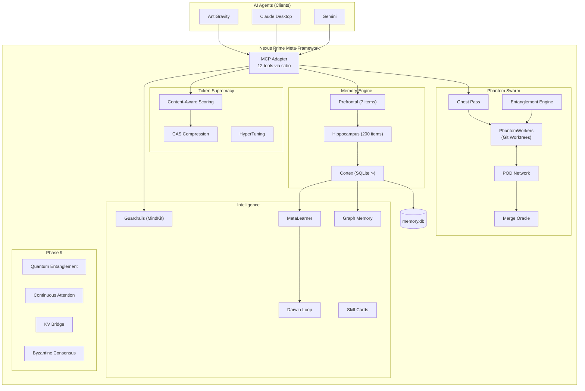
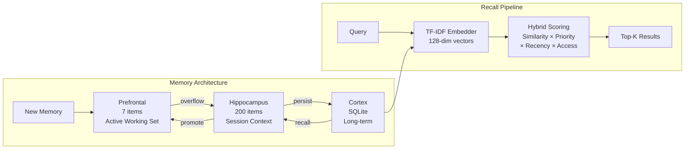
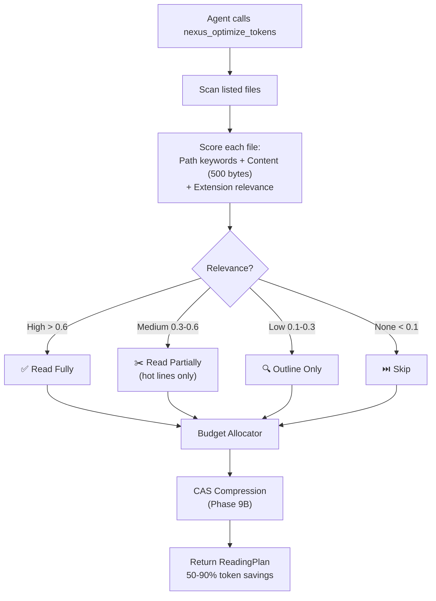
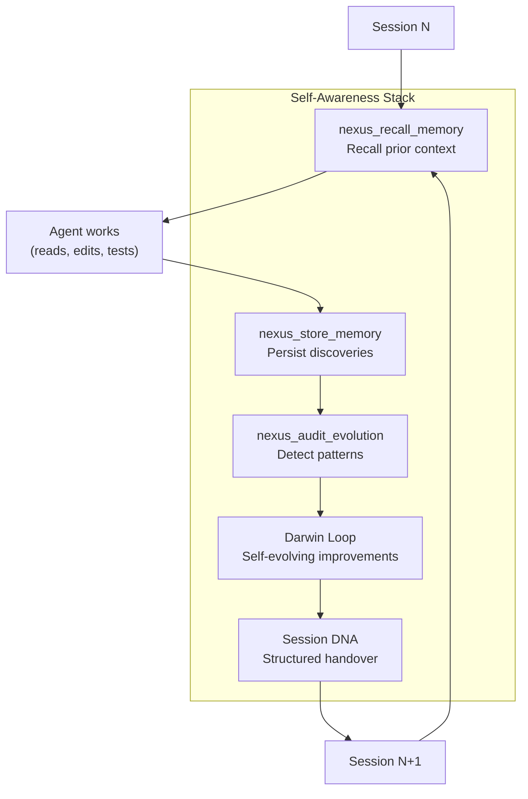
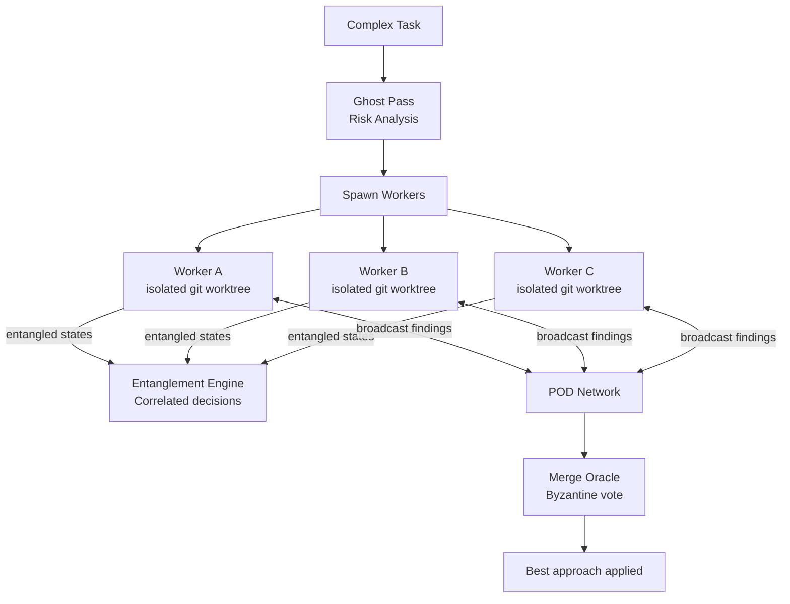
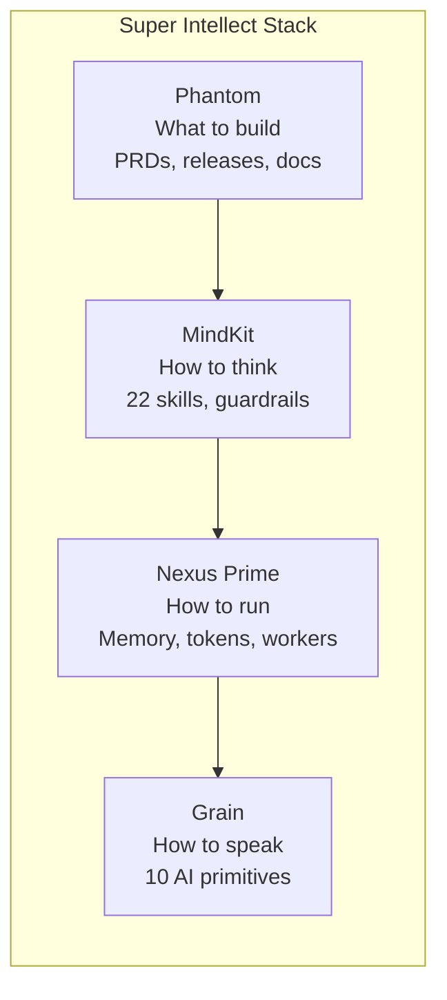

# 🤖 Nexus Prime — Multi-Agent Instruction Set for Gemini Flash

> **Purpose**: Step-by-step playbook for a Gemini Flash agent to maintain, document, release, and deploy Nexus Prime.
> **Target Model**: Gemini Flash 2.0 (low-tier, token-constrained).
> **Design**: Each section is a self-contained "agent task" that can be run independently.
> **Rule**: Follow each step EXACTLY. Do NOT skip steps. Do NOT improvise beyond what is written.

---

## Table of Contents

1. [Agent 1: Git Commit & Push](#agent-1-git-commit--push)
2. [Agent 2: GitHub Release](#agent-2-github-release)
3. [Agent 3: NPM Publish](#agent-3-npm-publish)
4. [Agent 4: README Rewrite](#agent-4-readme-rewrite-world-class-open-source)
5. [Agent 5: Architecture Docs Update](#agent-5-architecture-docs-update)
6. [Agent 6: Website & Link Audit](#agent-6-website--link-audit)
7. [Agent 7: AGENTS.md & GEMINI.md Sync](#agent-7-agentsmd--geminimd-sync)
8. [Agent 8: Mermaid Diagrams for Documentation](#agent-8-mermaid-diagrams-for-documentation)
9. [Agent 9: GitHub Pages Deployment](#agent-9-github-pages-deployment)
10. [Agent 10: Sub-Agent & Skill Definitions](#agent-10-sub-agent--skill-definitions)
11. [Agent 11: Git Worktree Operations](#agent-11-git-worktree-operations)
12. [Agent 12: Knowledge Base & Docs Site](#agent-12-knowledge-base--docs-site)
13. [MCP Memory FAQ](#mcp-memory-faq)
14. [Constants & References](#constants--references)

---

## Constants & References

```yaml
OWNER: sir-ad
REPO: nexus-prime
REPO_URL: https://github.com/sir-ad/nexus-prime
NPM_PACKAGE: nexus-prime
LICENSE: MIT
NODE_MIN: ">=18.0.0"
BRANCH: main
LOCAL_PATH: /Users/starlord/nexus-prime
BUILD_CMD: npm run build
TEST_CMD: npm run test
LINT_CMD: npm run lint
```

### Engine Files (29 total in `src/engines/`)

```
attention-stream.ts    benchmark.ts           byzantine-consensus.ts
cache-manager.ts       context-assembler.ts   context.ts
darwin-journal.ts      darwin-loop.ts         embedder.ts
entanglement.ts        entity-extractor.ts    event-bus.ts
graph-memory.ts        graph-traversal.ts     guardrails-bridge.ts
hilbert-space.ts       hybrid-retriever.ts    index.ts
kv-bridge.ts           memory.ts              meta-learner.ts
nexusnet-relay.ts      orchestrator.ts        pattern-codebook.ts
pod-network.ts         session-dna.ts         skill-card.ts
token-optimizer.ts     token-supremacy.ts
```

### Ecosystem Links (verified repos)

| Project | Repo URL | Status |
|---------|----------|--------|
| Nexus Prime | `https://github.com/sir-ad/nexus-prime` | Active |
| MindKit | `https://github.com/sir-ad/mindkit` | Active |
| Phantom | `https://github.com/sir-ad/phantom` | Active |
| Grain | `https://github.com/sir-ad/grain` | Active |

### MCP Tools (12 total, current)

| Tool | Phase |
|------|-------|
| `nexus_recall_memory` | Core |
| `nexus_store_memory` | Core |
| `nexus_memory_stats` | Core |
| `nexus_optimize_tokens` | Core |
| `nexus_ghost_pass` | Core |
| `nexus_mindkit_check` | Core |
| `nexus_spawn_workers` | Core |
| `nexus_audit_evolution` | Core |
| `nexus_entangle` | Phase 9A |
| `nexus_cas_compress` | Phase 9B |
| `nexus_kv_bridge_status` | Phase 9C |
| `nexus_kv_adapt` | Phase 9C |

---

## Agent 1: Git Commit & Push

**Goal**: Stage all changes, commit with a conventional commit message, push to `main`.

### Pre-flight Checks

```bash
cd /Users/starlord/nexus-prime
npm run build      # MUST pass with 0 errors
npm run test       # MUST pass all tests
npm run lint       # MUST have 0 errors (warnings OK)
```

> ⛔ If ANY of the above fails, FIX the error FIRST. Do NOT commit broken code.

### Commit Rules

1. **Conventional Commits** format: `type(scope): description`
2. Types: `feat`, `fix`, `docs`, `chore`, `refactor`, `test`, `ci`
3. Scope = affected area: `memory`, `phantom`, `mcp`, `engines`, `docs`, `readme`

### Steps

```bash
# 1. Check what changed
git status
git diff --stat

# 2. Stage all changes
git add .

# 3. Commit with conventional message
git commit -m "type(scope): description of what changed"

# 4. Push to main
git push origin main
```

### Examples

```bash
git commit -m "feat(engines): add Phase 9 quantum entanglement engine"
git commit -m "docs(readme): rewrite README with badges and architecture"
git commit -m "fix(mcp): correct CAS encode arguments in adapter"
```

---

## Agent 2: GitHub Release

**Goal**: Create a GitHub release with tag, changelog, and assets.

### Version Bump Rules

| Change Type | Bump | Example |
|------------|------|---------|
| Breaking API change | MAJOR | 0.2.0 → 1.0.0 |
| New feature (backward compatible) | MINOR | 0.2.0 → 0.3.0 |
| Bug fix only | PATCH | 0.2.0 → 0.2.1 |

### Steps

```bash
# 1. Decide new version (check current in package.json)
cat package.json | grep '"version"'
# Current: "0.2.0"

# 2. Update version in package.json
# Edit "version": "0.X.Y" to new version

# 3. Build and test
npm run build && npm run test

# 4. Commit the version bump
git add package.json
git commit -m "chore(release): bump version to 0.X.Y"

# 5. Create git tag
git tag -a v0.X.Y -m "Release v0.X.Y"

# 6. Push with tags
git push origin main --tags
```

### Changelog Template

Write the release body using this template:

```markdown
## What's New in v0.X.Y

### ✨ Features
- Feature 1 description
- Feature 2 description

### 🐛 Bug Fixes
- Fix 1 description

### 📦 Engine Count
- **29 engines** in `src/engines/`
- **12 MCP tools** exposed
- **21+ tests** passing

### 🛠️ Technical
- Node.js >= 18.0.0
- TypeScript 5.3+
- SQLite-backed memory persistence

### Full Changelog
https://github.com/sir-ad/nexus-prime/compare/vPREVIOUS...v0.X.Y
```

### Create Release via GitHub MCP

Use the GitHub MCP `create_or_update_file` tool or the GitHub web UI to create the release from the tag.

---

## Agent 3: NPM Publish

**Goal**: Publish the package to npm.

### Pre-requisites

- `NPM_TOKEN` secret must be set in GitHub repo settings under Environment `NPM_TOKEN`
- OR: local `npm login` must be done

### Steps (Local)

```bash
# 1. Ensure clean build
npm run build

# 2. Dry run first (safe)
npm publish --dry-run

# 3. If dry run looks good, publish
npm publish --access public
```

### Steps (CI — Automatic)

The CI workflow `.github/workflows/ci-publish.yml` handles this automatically:
- Triggers on: `release` event (type: `published`)
- Runs: `npm ci` → `npm run build` → `npm publish --access public --provenance`
- Requires: `NPM_TOKEN` secret in the `NPM_TOKEN` environment

> So just create a GitHub Release (Agent 2) and CI will handle npm publish.

---

## Agent 4: README Rewrite (World-Class Open Source)

**Goal**: Rewrite `README.md` to be a world-class open source README.

### File: `README.md` (root of repo)

### Required Sections (in this exact order)

```markdown
# 🧬 Nexus Prime

> One-line tagline goes here.

<!-- Badges row - ALL of these must be included -->
[](https://www.npmjs.com/package/nexus-prime)
[](LICENSE)
[](https://github.com/sir-ad/nexus-prime/actions)
[](https://nodejs.org)
[](https://typescriptlang.org)
[](https://github.com/sir-ad/nexus-prime/pulls)
[](https://github.com/sir-ad/nexus-prime/stargazers)
[](https://www.npmjs.com/package/nexus-prime)
```

### Section Checklist

Each section below MUST appear in the README. Use the heading text exactly.

1. **Badges** — see above (npm, license, CI, Node, TS, PRs, stars, downloads)
2. **One-paragraph description** — what it does, who it's for, why it matters
3. **"The Super Intellect Stack"** — the 4-project ecosystem diagram (Phantom → MindKit → Nexus Prime → Grain)
4. **"Why Nexus Prime?"** — bullet list of 5 key value propositions
5. **"Quick Start"** — install + MCP config (copy-paste ready, 3 steps max)
6. **"Architecture"** — Mermaid flowchart showing all 29 engines grouped by subsystem. MUST include Phase 9 engines: Entanglement, CAS, KV Bridge, Byzantine Consensus
7. **"The 12 MCP Tools"** — table with Tool name, When to use, What it does. Group into: Memory (3), Intelligence (3), Parallel Work (2), Phase 9 (4)
8. **"Memory System"** — 3-tier table (Prefrontal/Hippocampus/Cortex)
9. **"Phantom Workers"** — diagram showing GhostPass → Workers → POD → MergeOracle
10. **"Phase 9: Innovation Vectors"** — brief section on Quantum Entanglement, CAS, KV Bridge
11. **"Project Structure"** — tree showing ALL current directories and key files. MUST include all 29 engine files
12. **"Configuration"** — env vars table. Include NexusNet vars: `GITHUB_TOKEN`, `NEXUSNET_GIST_ID`
13. **"Contributing"** — standard open source contributing guidelines
14. **"Ecosystem"** — links to all 4 repos with descriptions
15. **"License"** — MIT with link to author

### Architecture Mermaid Diagram (MUST include these subsystems)

```
Core Engines:
  - MemoryEngine (3-tier: Prefrontal → Hippocampus → Cortex)
  - TokenSupremacyEngine (scoring, budget allocation, CAS integration)
  - GuardrailEngine (MindKit sync)
  - EmbedderEngine (TF-IDF + API fallback)
  - HyperTuning Engine
  - MetaLearner
  - CacheManager
  - ContextAssembler
  - EventBus

Phantom Swarm:
  - GhostPass
  - PhantomWorker (with Entanglement integration)
  - POD Network
  - MergeOracle

Phase 8 Engines:
  - SessionDNA
  - SkillCard
  - DarwinLoop + DarwinJournal
  - GraphMemory + GraphTraversal + EntityExtractor + HybridRetriever
  - NexusNet Relay
  - Benchmark Suite

Phase 9 Engines:
  - EntanglementEngine + HilbertSpace
  - ContinuousAttentionStream + PatternCodebook
  - KVBridge + ByzantineConsensus
```

### Writing Style Rules

- Use emoji sparingly (max 1 per section heading)
- Short sentences. No walls of text.
- Every code block must be copy-paste ready.
- Tables over paragraphs when listing features.
- Mermaid diagrams over ASCII art.

### Project Structure Tree (use this exact format)

```
nexus-prime/
├── src/
│   ├── index.ts                    # NexusPrime main class
│   ├── cli.ts                      # CLI entry point
│   ├── agents/
│   │   ├── adapters/mcp.ts         # MCP server (12 tools)
│   │   ├── coordinator.ts          # Worker dispatch
│   │   ├── orchestrator.ts         # Context-aware agent runner
│   │   └── learner.ts              # Evolution detection
│   ├── engines/                    # 29 engine files
│   │   ├── memory.ts               # 3-tier memory system
│   │   ├── token-supremacy.ts      # Token optimization + CAS
│   │   ├── guardrails-bridge.ts    # MindKit guardrails
│   │   ├── embedder.ts             # TF-IDF embeddings
│   │   ├── meta-learner.ts         # MAML adaptation
│   │   ├── cache-manager.ts        # Agent delta caching
│   │   ├── context-assembler.ts    # File chunking
│   │   ├── event-bus.ts            # Cross-engine events
│   │   ├── session-dna.ts          # Session handover
│   │   ├── skill-card.ts           # Transferable patterns
│   │   ├── darwin-loop.ts          # Self-evolution
│   │   ├── graph-memory.ts         # Knowledge graphs
│   │   ├── nexusnet-relay.ts       # Cross-machine federation
│   │   ├── entanglement.ts         # Quantum-inspired (Phase 9A)
│   │   ├── hilbert-space.ts        # Hilbert math primitives
│   │   ├── attention-stream.ts     # Continuous Attention (Phase 9B)
│   │   ├── pattern-codebook.ts     # Compression codebook
│   │   ├── kv-bridge.ts            # vLLM/Ollama bridge (Phase 9C)
│   │   ├── byzantine-consensus.ts  # PBFT consensus
│   │   └── ...                     # + 10 more support engines
│   ├── phantom/
│   │   ├── index.ts                # GhostPass + PhantomWorker
│   │   └── merge-oracle.ts         # Byzantine merge voting
│   └── dashboard/
│       └── index.html              # Real-time visualization
├── test/                           # Test suites
├── docs/                           # Website HTML
│   ├── index.html                  # Main documentation site
│   └── knowledge-base.html         # Knowledge base page
├── packages/mindkit/               # Standalone MindKit package
├── .github/workflows/
│   ├── ci-publish.yml              # Build + NPM publish
│   └── test-engines.yml            # Engine test runner
├── GEMINI.md                       # AI agent session protocol
├── AGENTS.md                       # Agent quick reference
├── NEXUS.md                        # Language specification
└── package.json                    # v0.2.0
```

---

## Agent 5: Architecture Docs Update

**Goal**: Update architecture documentation to reflect all 29 engines and Phase 9.

### Files to Update

1. `README.md` — Architecture section (see Agent 4)
2. `AGENTS.md` — Tool count (currently says 6, should say 12)
3. `GEMINI.md` — Tool count (currently says 8, add Phase 9 tools)
4. `NEXUS.md` — Review and update if needed

### AGENTS.md Fixes

Find and replace:

```diff
- ## 🔧 Available MCP Tools (6)
+ ## 🔧 Available MCP Tools (12)
```

Add these rows to the tool table:

```markdown
| `nexus_spawn_workers` | Parallel git worktree sub-agents |
| `nexus_audit_evolution` | Find recurring failure patterns |
| `nexus_entangle` | Quantum-inspired agent correlation |
| `nexus_cas_compress` | Continuous attention compression |
| `nexus_kv_bridge_status` | KV cache bridge metrics |
| `nexus_kv_adapt` | Adapt KV bridge to new tasks |
```

### GEMINI.md Fixes

Add Phase 9 tools to the Tool Reference table:

```markdown
| `nexus_entangle` | **Quantum coordination** — measure entangled agent states |
| `nexus_cas_compress` | **Token compression** — continuous attention stream encoding |
| `nexus_kv_bridge_status` | **KV monitoring** — bridge metrics and consensus status |
| `nexus_kv_adapt` | **KV adaptation** — adapt bridge to new task types |
```

Change the tool count from 8 to 12:

```diff
- Nexus Prime exposes **8 tools** via MCP.
+ Nexus Prime exposes **12 tools** via MCP.
```

---

## Agent 6: Website & Link Audit

**Goal**: Audit and fix all links in docs, README, and website HTML files.

### Files to Audit

| File | Path |
|------|------|
| README.md | `/Users/starlord/nexus-prime/README.md` |
| docs/index.html | `/Users/starlord/nexus-prime/docs/index.html` |
| docs/knowledge-base.html | `/Users/starlord/nexus-prime/docs/knowledge-base.html` |
| AGENTS.md | `/Users/starlord/nexus-prime/AGENTS.md` |
| GEMINI.md | `/Users/starlord/nexus-prime/GEMINI.md` |

### Link Validation Rules

1. **GitHub repo links** must point to `https://github.com/sir-ad/REPO_NAME`
2. **NPM links** must point to `https://www.npmjs.com/package/nexus-prime`
3. **Internal links** (anchors) must match actual heading IDs
4. **Ecosystem links** — verify all 4 repos exist:
   - `https://github.com/sir-ad/nexus-prime` ✅
   - `https://github.com/sir-ad/mindkit` — verify exists
   - `https://github.com/sir-ad/phantom` — verify exists
   - `https://github.com/sir-ad/grain` — verify exists
5. **Badge URLs** must use correct owner/repo: `sir-ad/nexus-prime`

### Steps

```bash
# 1. Extract all URLs from markdown files
grep -rn 'http' README.md AGENTS.md GEMINI.md NEXUS.md

# 2. Extract all URLs from HTML files
grep -rn 'href=' docs/index.html docs/knowledge-base.html

# 3. For each URL, verify it does not 404
# Test critical links manually:
curl -sL -o /dev/null -w "%{http_code}" https://github.com/sir-ad/nexus-prime
curl -sL -o /dev/null -w "%{http_code}" https://github.com/sir-ad/mindkit
curl -sL -o /dev/null -w "%{http_code}" https://github.com/sir-ad/phantom
curl -sL -o /dev/null -w "%{http_code}" https://github.com/sir-ad/grain
curl -sL -o /dev/null -w "%{http_code}" https://www.npmjs.com/package/nexus-prime

# 4. Fix any broken links found
# Replace 404 URLs with correct URLs or remove dead links
```

### Common Fix Patterns

| Broken Pattern | Fix |
|---------------|-----|
| `github.com/sir-ad/phantom` (404) | Remove or add `(coming soon)` note |
| `github.com/sir-ad/grain` (404) | Remove or add `(coming soon)` note |
| Missing `#anchor` links | Regenerate from actual headings |
| Old npm badge URL | Use `https://img.shields.io/npm/v/nexus-prime` |
| Broken relative links in HTML | Use absolute GitHub raw URLs |

### docs/index.html Rules

1. All navigation links must point to valid anchors or pages
2. Links to GitHub must use `https://github.com/sir-ad/nexus-prime`
3. "Get Started" buttons must link to `#quick-start` or valid section
4. External links must open in `target="_blank"`
5. Remove any links to non-existent pages

---

## Agent 7: AGENTS.md & GEMINI.md Sync

**Goal**: Ensure protocol docs match current codebase state.

### AGENTS.md Checklist

- [ ] Tool count matches actual (`12`, not `6`)
- [ ] All 12 tools listed in the table
- [ ] Session start protocol includes `nexus_recall_memory` + `nexus_memory_stats`
- [ ] Links to GitHub repos are correct
- [ ] No references to removed features

### GEMINI.md Checklist

- [ ] Tool count matches actual (`12`, not `8`)
- [ ] All 12 tools listed in the Tool Reference table
- [ ] `nexus_session_dna` tool is listed (currently in table but may not exist yet)
- [ ] MCP server command: `node /path/to/nexus-prime/dist/cli.js mcp`
- [ ] Memory path: `~/.nexus-prime/memory.db`
- [ ] Tag taxonomy is complete
- [ ] Anti-patterns section is current

---

## Agent 8: Mermaid Diagrams for Documentation

**Goal**: Create Mermaid diagrams for README, docs, and knowledge base. These go inside markdown files using ` ```mermaid ` code blocks.

### Diagram 1: Full System Architecture

Put this in `README.md` under the "Architecture" heading.



### Diagram 2: Memory System Tiers

Put this in `docs/knowledge-base.html` (inside a `<pre class="mermaid">` tag) and in `README.md`.



### Diagram 3: Token Optimization Flow

Shows how `nexus_optimize_tokens` saves 50-90% of token budget.



### Diagram 4: Agent Self-Awareness Loop

Shows how Nexus Prime enables agent self-awareness across sessions.



### Diagram 5: Phantom Worker Swarm



### Diagram 6: Nexus Prime Language (Grain)



### Where to Place Each Diagram

| Diagram | File | Section |
|---------|------|---------|
| 1. System Architecture | `README.md` | "Architecture" |
| 2. Memory Tiers | `README.md` + `docs/knowledge-base.html` | "Memory System" |
| 3. Token Optimization | `README.md` + `docs/knowledge-base.html` | "Token Optimization" |
| 4. Self-Awareness | `docs/knowledge-base.html` | "Self-Awareness" |
| 5. Phantom Swarm | `README.md` | "Phantom Workers" |
| 6. Language Stack | `README.md` | "The Super Intellect Stack" |

---

## Agent 9: GitHub Pages Deployment

**Goal**: Deploy documentation website to GitHub Pages from the `docs/` folder.

### Step 1: Enable GitHub Pages

Go to: `https://github.com/sir-ad/nexus-prime/settings/pages`

Set:
- **Source**: Deploy from a branch
- **Branch**: `main`
- **Folder**: `/docs`
- Click **Save**

The site will be live at: `https://sir-ad.github.io/nexus-prime/`

### Step 2: Create GitHub Actions Workflow for Pages

Create file: `.github/workflows/pages.yml`

```yaml
name: Deploy Docs to GitHub Pages

on:
  push:
    branches: [main]
    paths:
      - 'docs/**'

permissions:
  contents: read
  pages: write
  id-token: write

jobs:
  deploy:
    runs-on: ubuntu-latest
    environment:
      name: github-pages
      url: ${{ steps.deployment.outputs.page_url }}
    steps:
      - uses: actions/checkout@v4
      - uses: actions/configure-pages@v4
      - uses: actions/upload-pages-artifact@v3
        with:
          path: docs
      - id: deployment
        uses: actions/deploy-pages@v4
```

### Step 3: Fix All Links in docs/

Every link in `docs/index.html` and `docs/knowledge-base.html` MUST follow these rules:

| Link Type | Pattern |
|-----------|---------|
| Internal page | `knowledge-base.html` (relative, same folder) |
| GitHub repo | `https://github.com/sir-ad/nexus-prime` |
| NPM | `https://www.npmjs.com/package/nexus-prime` |
| External | Must have `target="_blank"` |
| Anchor | Must match an `id=""` attribute in the HTML |

### Step 4: Add Mermaid.js to HTML Pages

Add this script to `<head>` of ALL HTML files in `docs/`:

```html
<script type="module">
  import mermaid from 'https://cdn.jsdelivr.net/npm/mermaid@11/dist/mermaid.esm.min.mjs';
  mermaid.initialize({ startOnLoad: true, theme: 'dark' });
</script>
```

Then use `<pre class="mermaid">` tags for diagrams instead of markdown code blocks.

### Step 5: Verify Deployment

```bash
# After pushing docs/ changes:
# Wait 2-3 minutes for GitHub Pages to build
# Then verify:
curl -sL -o /dev/null -w "%{http_code}" https://sir-ad.github.io/nexus-prime/
curl -sL -o /dev/null -w "%{http_code}" https://sir-ad.github.io/nexus-prime/knowledge-base.html
```

---

## Agent 10: Sub-Agent & Skill Definitions

**Goal**: Define the sub-agent roles and skill cards used by Nexus Prime.

### Sub-Agent Roles

Nexus Prime can orchestrate multiple specialized sub-agents. Each has a defined role:

| Sub-Agent | Trigger | Behavior | Output |
|-----------|---------|----------|--------|
| **Ghost Pass Analyst** | `nexus_ghost_pass()` | Reads AST of target files, identifies risk areas, suggests approaches | Risk report + reading plan |
| **Phantom Worker** | `nexus_spawn_workers()` | Operates in isolated git worktree, executes task independently | `{ learnings, confidence, diff }` |
| **Merge Oracle** | After all workers finish | Byzantine vote on worker outputs, picks highest-confidence | Winning diff + merge decision |
| **Evolution Auditor** | `nexus_audit_evolution()` | Scans memory for recurring failures, identifies hotspot files | Pattern report + recommendations |
| **Guardrail Enforcer** | `nexus_mindkit_check()` | Validates proposed actions against 6 machine-checked rules | PASS/FAIL + score 0-100 |
| **Token Budget Planner** | `nexus_optimize_tokens()` | Scores files by relevance, builds token-efficient reading plan | ReadingPlan with 50-90% savings |
| **Memory Librarian** | `nexus_store/recall_memory()` | Manages 3-tier memory, TF-IDF recall, Zettelkasten linking | Stored/recalled memories |
| **CAS Compressor** | `nexus_cas_compress()` | Converts discrete tokens to continuous attention streams | AttentionFluid with compression ratio |
| **Entanglement Coordinator** | `nexus_entangle()` | Creates quantum-inspired correlated agent states | MeasurementResult with strategy index |
| **KV Bridge Manager** | `nexus_kv_bridge_status/adapt()` | Manages vLLM/Ollama KV cache bridge with Byzantine consensus | Bridge metrics + adaptation status |

### Skill Card Format

Skill cards are stored in `src/engines/skill-card.ts`. Each card defines:

```typescript
interface SkillCard {
  name: string;             // e.g., "debug_memory_leak"
  description: string;      // What this skill does
  triggerPatterns: string[]; // Keywords that activate this skill
  steps: string[];          // Ordered execution steps
  confidence: number;       // 0-1, how reliable this skill is
  usageCount: number;       // How many times it's been used
  lastUsed: number;         // Timestamp
}
```

### Default Skill Cards to Document

| Skill | Trigger | Steps |
|-------|---------|-------|
| `debug_typescript_error` | "tsc error", "type mismatch" | 1. Read error message 2. Find file:line 3. Check type definitions 4. Fix type 5. Run build |
| `optimize_token_budget` | "token", "budget", "context" | 1. Call nexus_optimize_tokens 2. Follow reading plan 3. Store findings |
| `parallel_refactor` | "refactor 3+ files" | 1. Ghost Pass 2. Spawn workers 3. Wait for MergeOracle 4. Apply winner |
| `memory_recall_pattern` | "remember", "last session" | 1. nexus_recall_memory(query, k=8) 2. Trust results 3. Skip re-reading |
| `safe_destructive_op` | "delete", "drop", "remove" | 1. nexus_mindkit_check(isDestructive=true) 2. If PASS, proceed 3. If FAIL, abort |

### Where to Document

1. Add a "Sub-Agents" section to `README.md` with the sub-agent table
2. Add a "Skill Cards" section to `docs/knowledge-base.html`
3. Add the skill card interface to `AGENTS.md`

---

## Agent 11: Git Worktree Operations

**Goal**: Use git worktrees for parallel isolated development.

### What Are Git Worktrees?

Git worktrees let you check out multiple branches simultaneously in separate directories. Nexus Prime's `PhantomWorker` uses them to run parallel tasks without conflicts.

### Creating a Worktree

```bash
# Create a worktree for a specific task
git worktree add ../nexus-worker-A -b worker/task-A

# Create another parallel worktree
git worktree add ../nexus-worker-B -b worker/task-B
```

### Working in a Worktree

```bash
# Switch to worktree A
cd ../nexus-worker-A

# Make changes, build, test
npm run build && npm run test

# Commit changes
git add . && git commit -m "feat(worker-A): implement approach A"
```

### Merging Worktree Results

```bash
# Go back to main repo
cd /Users/starlord/nexus-prime

# Merge the winning approach
git merge worker/task-A

# Clean up worktrees
git worktree remove ../nexus-worker-A
git worktree remove ../nexus-worker-B

# Delete branches
git branch -d worker/task-A worker/task-B
```

### List Active Worktrees

```bash
git worktree list
```

### When to Use Worktrees

| Scenario | Use Worktree? |
|----------|---------------|
| Editing 1-2 files | ❌ No |
| Refactoring 3+ interrelated files | ✅ Yes |
| Trying 2 different approaches | ✅ Yes |
| Testing a risky change | ✅ Yes |
| Bug fix on a different branch | ✅ Yes |

### Integration with Phantom Workers

When `nexus_spawn_workers` is called, it internally:
1. Creates worktrees: `git worktree add /tmp/nexus-worker-{id} -b phantom/{id}`
2. Runs the task in each worktree independently
3. Workers broadcast findings via POD Network
4. MergeOracle evaluates and picks the winner
5. Winning changes are merged back to main
6. Worktrees are cleaned up: `git worktree remove`

---

## Agent 12: Knowledge Base & Docs Site

**Goal**: Build comprehensive documentation site hosted on GitHub Pages.

### Required Pages

The `docs/` folder must contain these files:

| File | Purpose |
|------|---------|
| `index.html` | Main landing page — overview, features, quick start |
| `knowledge-base.html` | Technical deep-dive — all diagrams, engine details |
| `architecture.html` | **[NEW]** Full architecture reference with interactive diagrams |
| `api-reference.html` | **[NEW]** All 12 MCP tools with parameters and examples |
| `changelog.html` | **[NEW]** Version history and release notes |

### index.html Requirements

1. Hero section with project name, tagline, badges
2. "Get Started" with 3-step install
3. Feature grid (6 cards): Memory, Tokens, Workers, Guardrails, Evolution, Phase 9
4. Ecosystem section linking to Phantom, MindKit, Grain
5. Footer with GitHub, NPM, License links
6. **ALL links must work** — no 404s

### knowledge-base.html Requirements

1. All 6 Mermaid diagrams from Agent 8
2. Memory System deep-dive (3-tier explanation)
3. Token Optimization explainer (how scoring works)
4. Self-Awareness Loop (how sessions connect)
5. Phantom Worker flow (worktrees, POD, MergeOracle)
6. Phase 9 Innovation Vectors (Entanglement, CAS, KV Bridge)
7. Sub-Agent & Skill Card reference table

### architecture.html Content

1. Full system architecture Mermaid diagram
2. Engine-by-engine breakdown table:

| Engine | File | Purpose | Phase |
|--------|------|---------|-------|
| MemoryEngine | `memory.ts` | 3-tier persistent memory | Core |
| TokenSupremacy | `token-supremacy.ts` | Content-aware token optimization | Core |
| Embedder | `embedder.ts` | TF-IDF 128-dim vectors | Core |
| GuardrailsBridge | `guardrails-bridge.ts` | MindKit sync + rule enforcement | Core |
| MetaLearner | `meta-learner.ts` | MAML-based adaptive learning | Core |
| CacheManager | `cache-manager.ts` | Agent delta caching | Core |
| ContextAssembler | `context-assembler.ts` | File chunking + context building | Core |
| EventBus | `event-bus.ts` | Cross-engine event system | Core |
| PODNetwork | `pod-network.ts` | Worker communication | Phantom |
| SessionDNA | `session-dna.ts` | Structured session handover | Phase 8 |
| SkillCard | `skill-card.ts` | Transferable agent patterns | Phase 8 |
| DarwinLoop | `darwin-loop.ts` | Self-evolving code improvements | Phase 8 |
| GraphMemory | `graph-memory.ts` | Knowledge graph storage | Phase 8 |
| NexusNetRelay | `nexusnet-relay.ts` | Cross-machine federation | Phase 8 |
| Benchmark | `benchmark.ts` | Performance measurement | Phase 8 |
| Entanglement | `entanglement.ts` | Quantum-inspired agent correlation | Phase 9A |
| HilbertSpace | `hilbert-space.ts` | Hilbert math (tensor, Born rule) | Phase 9A |
| AttentionStream | `attention-stream.ts` | Continuous token compression | Phase 9B |
| PatternCodebook | `pattern-codebook.ts` | Learned compression dictionary | Phase 9B |
| KVBridge | `kv-bridge.ts` | vLLM/Ollama inference bridge | Phase 9C |
| ByzantineConsensus | `byzantine-consensus.ts` | PBFT multi-agent sync | Phase 9C |

3. Data flow diagram showing request lifecycle
4. EventBus event catalog (all event types by phase)

### api-reference.html Content

For each of the 12 MCP tools, document:

```
Tool Name: nexus_recall_memory
Description: Semantic recall from 3-tier memory
Parameters:
  - query (string, required): What to search for
  - k (number, optional, default=5): Number of results
Returns: Array of memories with content, priority, tags, score
Example:
  nexus_recall_memory({ query: "sqlite memory bug", k: 8 })
When to Use: Session start, mid-session when you need prior context
```

### HTML Template Rules

1. Use dark theme (background: `#0f172a`, text: `#e2e8f0`)
2. Include Mermaid.js CDN script (see Agent 9)
3. Navigation bar must link to ALL docs pages
4. Every page must have a "Back to GitHub" link
5. Use `<pre class="mermaid">` for Mermaid diagrams in HTML
6. Responsive design — must work on mobile
7. Syntax highlighting via Prism.js or Highlight.js

### Navigation Structure

All pages must have this nav bar:

```html
<nav>
  <a href="index.html">Home</a>
  <a href="knowledge-base.html">Knowledge Base</a>
  <a href="architecture.html">Architecture</a>
  <a href="api-reference.html">API Reference</a>
  <a href="changelog.html">Changelog</a>
  <a href="https://github.com/sir-ad/nexus-prime">GitHub</a>
  <a href="https://www.npmjs.com/package/nexus-prime">NPM</a>
</nav>
```

---

## MCP Memory FAQ

**Q: When I call `nexus_recall_memory`, it shows old "CRITICAL BUG" messages. Is something broken?**

**A: No, this is normal.** The memory system recalls ALL semantically relevant memories, including historical ones about bugs that have since been fixed. The fix is documented in later memories (e.g., "Session 2026-03-03 Phase 3 COMPLETE: All 9 tasks done. P0: Token optimizer 0→100%").

**How to interpret recall results:**

1. Look for the MOST RECENT session-summary memory — it has the current state
2. If a memory says "CRITICAL BUG" but a later memory says "FIXED" — it's fixed
3. Historical memories are valuable context — they explain WHY code is written a certain way
4. If unsure, check the actual code — `git log --oneline -10` shows recent changes

**Q: Why does it recall 43+ calls and 700+ Zettel links?**

**A: That's the telemetry footer.** It shows:
- `43 calls` = total MCP calls in this session
- `766 Zettel links` = total cross-references in the knowledge graph
- This is healthy and means memory is working well

**Q: How do I clear old memories?**

**A:** Delete the SQLite database: `rm ~/.nexus-prime/memory.db` and restart. Only do this if you want a complete fresh start.

---

## Orchestration Order (Updated)

When running all agents, execute in this order:

```
Phase 1 — Audit & Research:
  1. Agent 6:  Website & Link Audit
  2. Agent 11: Git Worktree Setup (create worktree for docs work)

Phase 2 — Content Creation:
  3. Agent 8:  Mermaid Diagrams (create all 6 diagrams)
  4. Agent 10: Sub-Agent & Skill Definitions
  5. Agent 5:  Architecture Docs Update
  6. Agent 4:  README Rewrite

Phase 3 — Website & Docs:
  7. Agent 12: Knowledge Base & Docs Site
  8. Agent 9:  GitHub Pages Deployment
  9. Agent 7:  Protocol Sync (GEMINI.md + AGENTS.md)

Phase 4 — Ship:
  10. Agent 1: Git Commit & Push
  11. Agent 2: GitHub Release
  12. Agent 3: NPM Publish
```

### Updated Dependency Graph

```
Phase 1:  Agent 6 ──→ Agent 11 (worktree)
              │
Phase 2:      ├──→ Agent 8 (diagrams) ──→ Agent 10 (skills) ──→ Agent 5 (arch)
              │                                                      │
              │                                                      ▼
              └──────────────────────────────────────────────→ Agent 4 (readme)
                                                                     │
Phase 3:                                                             ▼
                                                        Agent 12 (docs) ──→ Agent 9 (pages) ──→ Agent 7 (sync)
                                                                                                      │
Phase 4:                                                                                              ▼
                                                                                         Agent 1 (commit) ──→ Agent 2 (release) ──→ Agent 3 (npm)
```

---

## Quick Command Reference

```bash
# Build
npm run build

# Test
npm run test

# Lint
npm run lint

# Full pre-commit check
npm run build && npm run test && npm run lint

# Git commit + push
git add . && git commit -m "type(scope): message" && git push origin main

# Tag release
git tag -a v0.X.Y -m "Release v0.X.Y" && git push origin main --tags

# NPM publish (manual)
npm publish --access public

# Start MCP server (for testing)
node dist/cli.js mcp

# Run dashboard
node dist/cli.js start

# Git worktrees
git worktree add ../nexus-worker-A -b worker/task-A
git worktree list
git worktree remove ../nexus-worker-A
```

---

## Error Recovery

| Error | Fix |
|-------|-----|
| `tsc` build fails | Check TypeScript errors, fix type mismatches |
| Test fails | Run failing test in isolation: `npx tsx test/FILE.test.ts` |
| `npm publish` 403 | Check `NPM_TOKEN` is set and has publish access |
| `git push` rejected | Pull first: `git pull --rebase origin main` |
| Dashboard won't load | Ensure `cp src/dashboard/index.html dist/dashboard/` ran during build |
| Memory DB locked | Kill other `nexus-prime` processes: `pkill -f "cli.js mcp"` |
| GitHub Pages 404 | Check Settings > Pages > Source is `main` branch, `/docs` folder |
| Mermaid not rendering | Ensure Mermaid.js CDN script is in `<head>` |
| Worktree conflict | `git worktree prune` then retry |
| Memory shows old bugs | Normal — check most recent session-summary memory for current state |

---

*Generated: 2026-03-04 | Nexus Prime v0.2.0 | 29 engines, 12 MCP tools, 21+ tests | 12 agent tasks*
