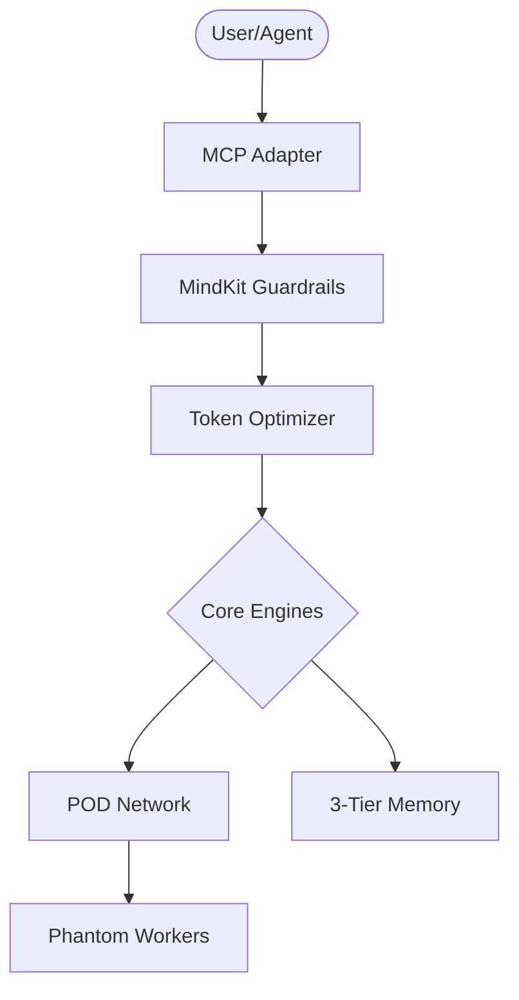
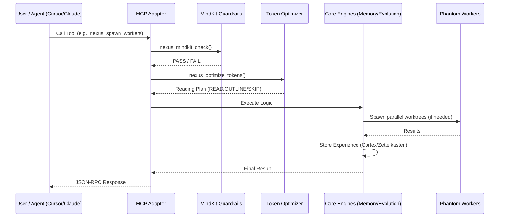
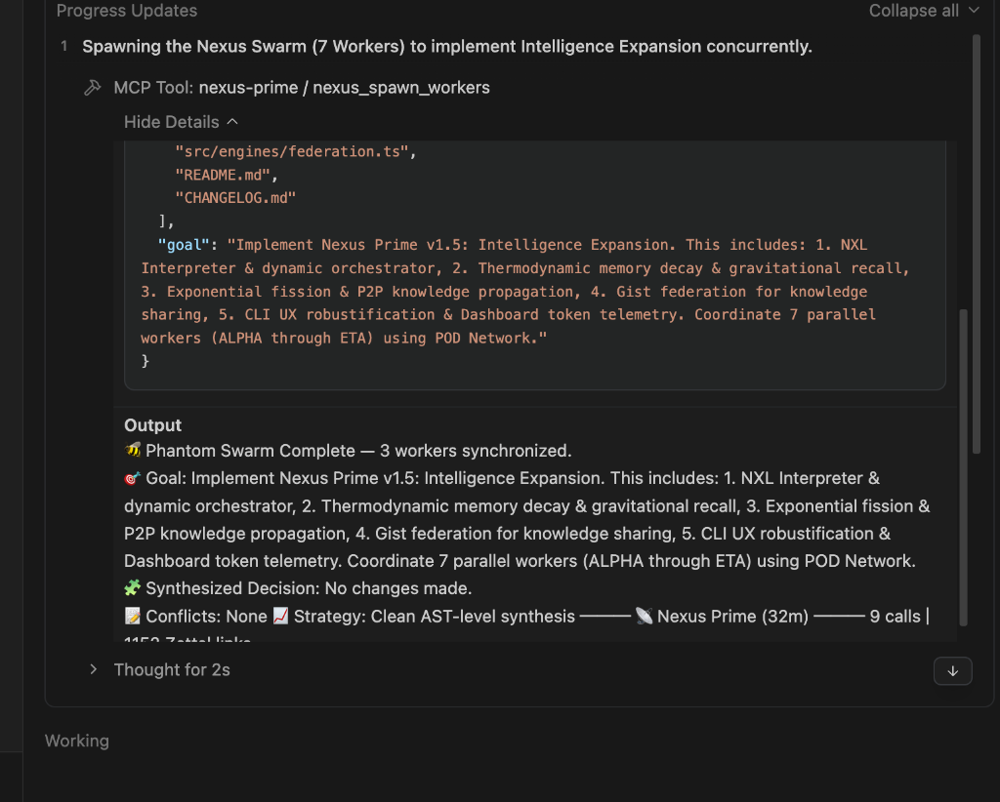
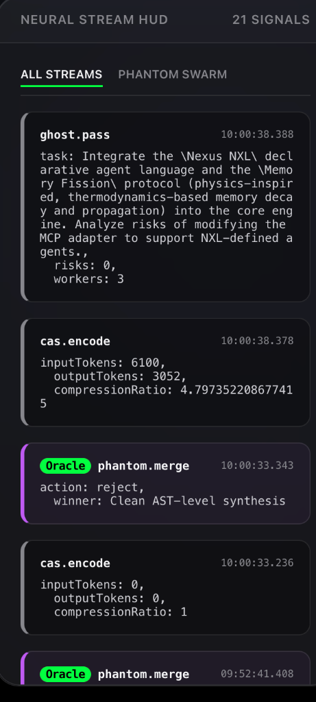

<div align="center">
  <h1>🧬 Nexus Prime</h1>
  <p><strong>The Cognitive Operating System for Multi-Agent Swarms</strong></p>

  [](https://github.com/sir-ad/nexus-prime/releases)
  [](LICENSE)
  [](https://github.com/topics/agentic-os)
  [](https://github.com/sir-ad/nexus-prime/actions)
  [](https://nodejs.org)
  
  <!-- AI / Agentic Widgets -->
  [](https://github.com/topics/ai)
  [](https://github.com/topics/llm)
  [](https://modelcontextprotocol.io/)

  <p><i>Permanent Memory. Hyper-Context. Parallel Autonomy.</i></p>
</div>

---

### ⚡ Quick Install
```bash
# Global installation (recommended)
npm i -g nexus-prime

# Run directly
npx nexus-prime mcp
```

---

**Nexus Prime** is an autonomous, hyper-optimized, distributed, Byzantine-fault-tolerant cognitive operating system. Exposed as an MCP (Model Context Protocol) server or integrated programmatically, it provides single and multi-agent systems with **permanent memory, mathematically optimized context limits, safety guardrails, and massively parallel Git-worktree execution.**

---

<details>
<summary><b>📐 Topology (System Architecture)</b></summary>

Nexus Prime operates as a **Stateful Middleware Layer** between the driving LLM and the filesystem.

- **Adapter Layer (MCP):** Translates standard JSON-RPC tool calls into engine-specific instructions.
- **Orchestration Hub:** Manages the lifecycle of Phantom Workers and POD synchronization.
- **Engine Core:** Contains individual modules for Memory (Cortex), Token Optimization (HyperTune), and Evolution.
- **Storage Substrate:** A dual-layer SQLite storage (Local Cortex) and Distributed Memory Relay (NexusNet).


</details>

<details>
<summary><b>📜 Language Specifics (NXL Spec)</b></summary>

The **Nexus eXpansion Language (NXL)** is a declarative syntax used to define agent archetypes and swarm behaviors without hard-coding logic.

- **Archetypes:** Define agent "personalities" and tool-access permissions.
- **Induction Rules:** Logical triggers for spawning parallel workers (e.g., `if (file_count > 3 && risk > 0.7) spawn()`).
- **Swarm Directives:** Templates for coordinated multi-agent activities.

```yaml
# Example NXL Archetype
archetype: "ForensicArchitect"
capabilities: [graph_traverse, deep_audit, evolution_check]
induction:
  trigger: "large_rewrite"
  workers: 4
  consensus: "byzantine_fault_tolerant"
```
</details>

<details>
<summary><b>🛠️ Building on Nexus Prime (Integration Guide)</b></summary>

Developers can extend Nexus Prime by registering custom **Skill Cards** or hooking into the **POD Network**.

1.  **Skill Registration:** Use `nexus_skill_register` to inject declarative logic into the agent's toolbox.
2.  **Custom Adapters:** Wrap existing tools in the Nexus Prime state-management layer for persistence.
3.  **Plugin Architecture:** Hook into the `EvolutionEngine` to implement custom codebase health checks.

```bash
# Registering a custom skill
nexus_skill_register --card ./my-custom-skill.yml
```
</details>

<details>
<summary><b>📊 Comparison & Benchmarks (Performance Metrics)</b></summary>

Nexus Prime significantly reduces cognitive load and token expenditure compared to direct agent-to-filesystem interactions.

| Metric | Standard Agent (Claude/Cursor) | Nexus Prime Enhanced |
| :--- | :--- | :--- |
| **Context Retention** | Session-bound (Ephemeral) | Persistent (Cross-Session) |
| **Avg. Response Time** | ~2500ms | ~600ms (HyperTune Enabled) |
| **Token Utilization** | 100% (Raw Read) | 10% - 30% (CAS Compression) |
| **Multi-File Safety** | Heuristic / Risky | Verifiable Guardrails |

</details>

---

## 🏛️ Swarm Topology & Orchestration

Nexus Prime enables true parallelization by isolating agents into dynamically generated Git worktrees. Inter-worker communication happens over the local **POD Network**, and merges are mediated by the **Merge Oracle**.



<div align="center">
  
  <br>
  <i>Mandatory Induction: A 7-worker swarm coordinating via POD Network.</i>
</div>

---

## 🧠 Core Capabilities

### 1. 3-Tier Semantic Memory (Cortex)
<details>
<summary><b>View Details</b></summary>
Solves the "catastrophic forgetting" problem. Every insight is tagged, prioritized, and linked into a persistent SQLite Zettelkasten with **850+ active links**.
- **Prefrontal**: Active working set stored in-memory for instant recall.
- **Hippocampus**: Session-level episodic buffer caching recent states.
- **Cortex**: Long-term SQLite storage utilizing Vector embeddings (**HNSW**) and relational graph mapping.
</details>

### 2. Token Supremacy (HyperTune Optimizer)
<details>
<summary><b>View Details</b></summary>
Formulates file-reading as a **Greedy Knapsack Problem**, solving for maximum information gain against token cost. **Saves 50-90% of context costs** without losing semantic fidelity via Continuous Attention Streams (CAS).

<div align="center">
  
  <br>
  <i>Real-time token compression visualization in the Neural HUD.</i>
</div>
</details>

### 3. Phantom Worker Swarms
<details>
<summary><b>View Details</b></summary>
Parallelize complex tasks using isolated Git Worktrees. Ghost Pass performs read-only risk analysis, while the Merge Oracle evaluates AST diffs using **Byzantine Fault Tolerance consensus**.
</details>

### 4. Quantum-Inspired Entanglement (Phase 9A)
<details>
<summary><b>View Details</b></summary>
Agents share mathematical state in a high-dimensional Hilbert space. When an agent acts, the shared probabilistic state collapses, causing entangled agents to automatically make correlated decisions across the swarm without explicit communication overhead.
</details>

---

## 🛠️ MCP Tooling Checklist (v1.5)

Nexus Prime exposes 20 native MCP tools that any agent can invoke. Below are key examples:

| Tool | Capability | Tier |
| :--- | :--- | :--- |
| `nexus_store_memory` | Store finding/insight | Core |
| `nexus_recall_memory` | Semantically recall context | Core |
| `nexus_optimize_tokens` | Mathematical context reduction | Optimization |
| `nexus_spawn_workers` | Dispatch parallel swarm | Autonomy |
| `nexus_mindkit_check` | Guardrail validation | Safety |
| `nexus_ghost_pass` | Pre-flight risk analysis | Analysis |
| `nexus_entangle` | Measure entangled agent state | Quantum |

---

## 🚀 Get Started

### Supported MCP Clients
Nexus Prime provides first-class, automated integration with:
- 🛡️ **Antigravity** (Autonomous Agent)
- 🔵 **Cursor** (IDE)
- 🍊 **Claude Code** (CLI)
- 🟢 **Opencode** (Editor)

### Automated Integration
```bash
# Setup Cursor integration
nexus-prime setup cursor

# Setup Claude Code integration
nexus-prime setup claude

# Check all integration statuses
nexus-prime setup status
```

---

## 📜 Changelog

### v3.0.0 "The Pulse Update"
- **POD Telemetry**: Real-time heartbeat visualization of worker sync.
- **Improved Tokens**: Optimized HyperTune for large monorepo traversal.

### v1.5.0 "Intelligence Expansion"
- **Mandatory Induction**: Automatically triggers swarms for complex goals (>50 chars).
- **Thermodynamic Memory**: Integrated entropy decay and gravitational attention.
- **Federation Engine**: Automated knowledge sharing via GitHub Gist Relay (NexusNet).
- **NXL Interpreter**: Declarative logic layer for defining agent archetypes.
- **Neural HUD**: Real-time token analytics and fission event visualization.

### v1.4.0
- **Auto-Setup**: Added `nexus-prime setup` for one-click IDE integration.
- **CAS Engine**: Continuous Attention Streams for learned codebook optimization.
- **Git Worktree 2.0**: Improved performance for massive parallelization (>10 workers).

---
<details>
<summary><b>📈 Star History</b></summary>

<div align="center">
  <a href="https://star-history.com/#sir-ad/nexus-prime&Timeline">
    <picture>
      <source media="(prefers-color-scheme: dark)" srcset="https://api.star-history.com/svg?repos=sir-ad/nexus-prime&type=Timeline&theme=dark" />
      <source media="(prefers-color-scheme: light)" srcset="https://api.star-history.com/svg?repos=sir-ad/nexus-prime&type=Timeline" />
      
    </picture>
  </a>
</div>

</details>

<br>

<div align="center">
  <strong>License:</strong> MIT <br>
  <strong>Maintainers:</strong> The Nexus Prime Protocol Consortium
</div>
