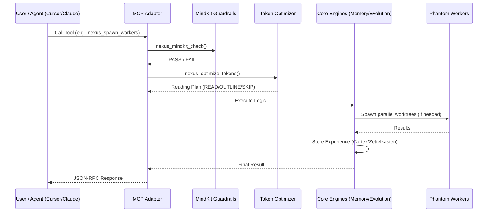
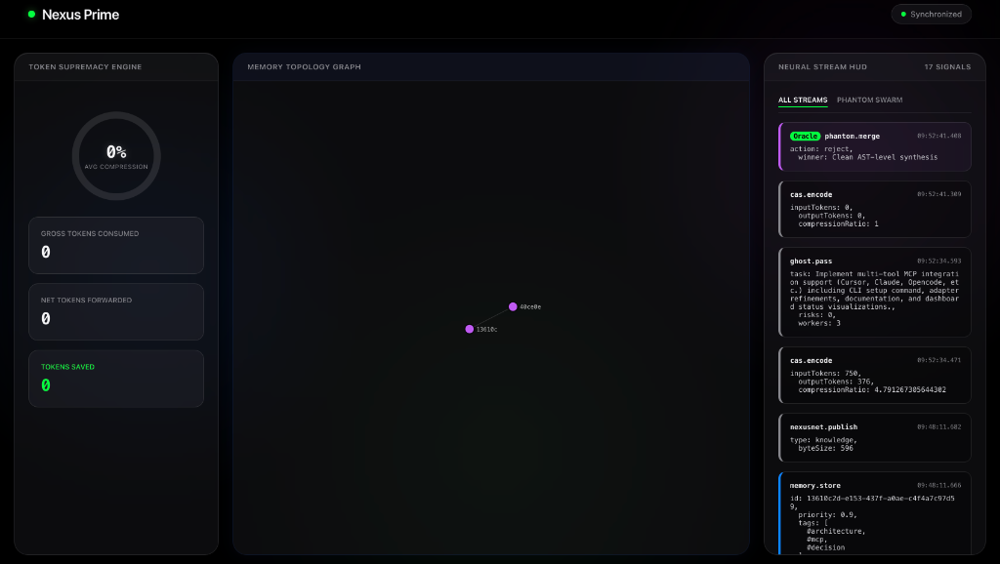

<div align="center">
  <h1>🧬 Nexus Prime</h1>
  <p><strong>The Cognitive Operating System for Multi-Agent Swarms</strong></p>

  [](https://github.com/sir-ad/nexus-prime/releases)
  [](LICENSE)
  [](https://github.com/topics/agentic-os)

</div>

---

### ⚡ Quick Install
```bash
# Global installation (recommended)
npm i -g nexus-prime

# Run directly
npx nexus-prime mcp
```

---

**Nexus Prime** is a hyper-optimized, distributed, Byzantine-fault-tolerant cognitive operating system. Exposed as an MCP (Model Context Protocol) server or integrated programmatically, it provides single and multi-agent systems with **permanent memory, mathematically optimized context limits, safety guardrails, and massively parallel Git-worktree execution.**

---

## 🏛️ Architecture & Swarm Topology

Nexus Prime enables true parallelization by isolating agents into dynamically generated Git worktrees. Inter-worker communication happens over the local **POD Network**, and merges are mediated by the **Merge Oracle**.




*Mandatory Induction: A 7-worker swarm coordinating via POD Network.*

---

## 🧠 Core Capabilities

### 1. 3-Tier Semantic Memory (Cortex)
Solves the "catastrophic forgetting" problem. Every insight is tagged, prioritized, and linked into a persistent SQLite Zettelkasten with **820+ Zettelkasten links**.
- **Prefrontal**: Active working set
- **Hippocampus**: Session cache
- **Cortex**: Long-term SQLite storage

### 2. Token Supremacy (HyperTune Optimizer)
Formulates file-reading as a **Greedy Knapsack Problem**, solving for maximum information gain against token cost. **Saves 50-90% of context costs** without losing semantic fidelity.


*Real-time token compression visualization in the Neural HUD.*

### 3. Phantom Worker Swarms
Parallelize complex tasks using isolated Git Worktrees. Ghost Pass performs read-only risk analysis, while the Merge Oracle evaluates AST diffs using **Byzantine consensus**.

### 4. Quantum-Inspired Entanglement (Phase 9A)
Agents share mathematical state in a high-dimensional Hilbert space. When an agent acts, the shared state collapses, causing entangled agents to automatically make correlated decisions.

---

## 🚀 Get Started

### Supported MCP Clients
Nexus Prime provides first-class, automated integration with:
- 🛡️ **Antigravity** (Autonomous Agent)
- 🔵 **Cursor** (IDE)
- 🍊 **Claude Code** (CLI)
- 🟢 **Opencode** (Editor)

### Automated Integration
```bash
# Setup Cursor integration
nexus-prime setup cursor

# Setup Claude Code integration
nexus-prime setup claude

# Check all integration statuses
nexus-prime setup status
```

---

## 🛠️ CLI Commands & Tooling

| Request Intent | Sub-Agents Spawned | Execution Order |
|---|---|---|
| "Full stack feature" | UX Designer + Backend Engineer | **Parallel**, POD Mesh |
| "Database Migration" | DB Architect → Backend Engineer | **Sequential Pipeline** |
| "Bug Hunt" | 3x Parallel QA Agents | **Parallel Competitive** |


*Watch the swarm think in real-time with the SSE-powered dashboard.*

---

## 📜 Changelog

### v1.5.0-alpha.1 "Intelligence Expansion"
- **Mandatory Induction**: Automatically triggers swarms for complex goals (>50 chars).
- **Thermodynamic Memory**: Integrated entropy decay and gravitational attention.
- **Federation Engine**: Automated knowledge sharing via GitHub Gist Relay (NexusNet).
- **NXL Interpreter**: Declarative logic layer for defining agent archetypes.
- **Neural HUD**: Real-time token analytics and fission event visualization.

### v1.4.0
- **Auto-Setup**: Added `nexus-prime setup` for one-click IDE integration.
- **CAS Engine**: Continuous Attention Streams for learned codebook optimization.
- **Git Worktree 2.0**: Improved performance for massive parallelization (>10 workers).

---
 
**License:** MIT  
**Maintainers:** The Nexus Prime Protocol Consortium
