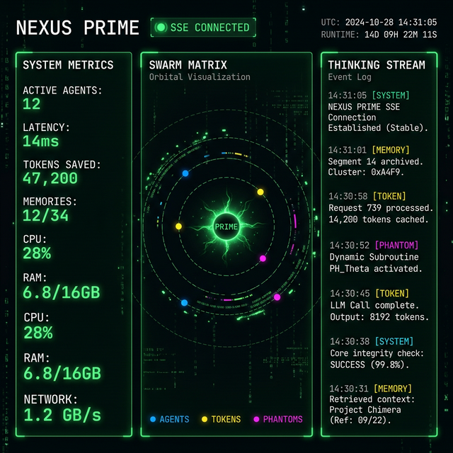
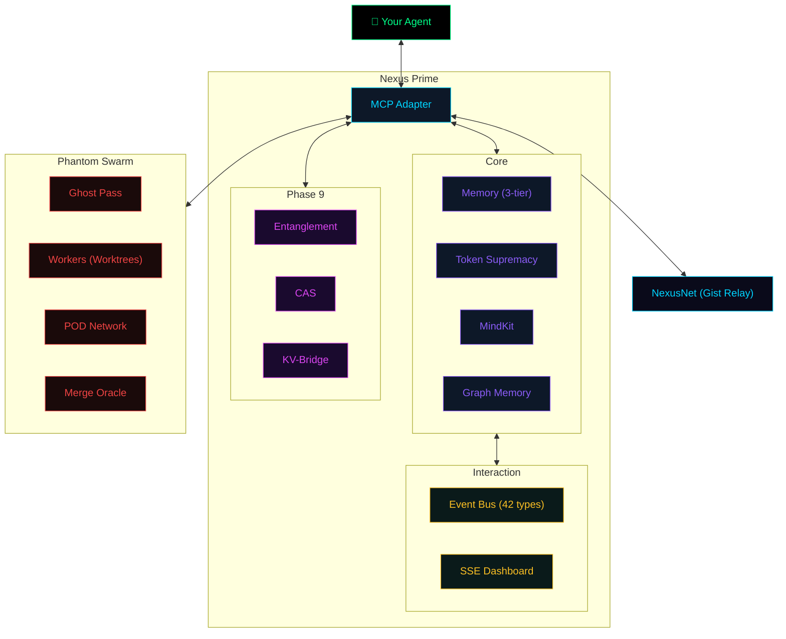

# 🧬 Nexus Prime

**Give your AI agent a brain that persists, thinks, and learns.**

[](LICENSE)
[](https://nodejs.org)
[](https://typescriptlang.org)
[](#-20-mcp-tools)
[](#-system-architecture)

---

## The Problem

Every AI agent session starts with **total amnesia**. Your agent forgets yesterday's bug fix. It wastes 80% of its context window re-reading files it already understood. And when a task is complex enough to need multiple approaches, it works alone — sequentially, slowly.

## The Solution

Nexus Prime is an **MCP server** that runs alongside your AI agent and gives it four superpowers:

| Superpower | What It Does |
|:---|:---|
| **🧠 Persistent Memory** | 3-tier knowledge system (Prefrontal → Hippocampus → Cortex). 820+ Zettelkasten links. Survives restarts. |
| **⚡ Token Supremacy** | HyperTune™ optimizer reads only the relevant chunks. 50-90% context window savings. |
| **🐝 Phantom Swarms** | Parallel workers in isolated Git Worktrees. Ghost Pass risk analysis → Spawn → Byzantine Merge. |
| **🛡️ MindKit Guardrails** | Machine-checked safety. Scores 0-100. Blocks destructive ops before they happen. |

---

## ⚡ 30-Second Quickstart

```bash
# Clone and build
git clone https://github.com/sir-ad/nexus-prime.git
cd nexus-prime && npm install && npm run build

# Verify
npm test  # 19/19 passed
```

Add to your agent's MCP config (Cursor, Claude Desktop, etc.):

```json
{
  "nexus-prime": {
    "command": "node",
    "args": ["/path/to/nexus-prime/dist/cli.js", "mcp"]
  }
}
```

Call `nexus_memory_stats()` from your agent to confirm the cortex is online.

---

## 📊 Real-Time Dashboard

Nexus Prime includes a **built-in visualization dashboard** powered by Server-Sent Events (SSE). Watch your agent's memory stores, token optimizations, phantom dispatches, and guardrail checks stream in real time — 42 event types, zero polling.

```bash
npm start  # Opens dashboard at localhost:3000
```



---

## 🛠️ 20 MCP Tools

Every capability is a native MCP tool. No SDK, no REST — just function calls.

### 💾 Memory & Knowledge
| Tool | Purpose |
|:---|:---|
| `nexus_store_memory` | Persist insights with priority + tags to long-term cortex |
| `nexus_recall_memory` | Semantic vector search — finds "login bug" when you search "auth issue" |
| `nexus_memory_stats` | Tier counts, Zettelkasten density, session telemetry |
| `nexus_graph_query` | BFS/DFS traversal of the knowledge graph |

### ⚡ Optimization
| Tool | Purpose |
|:---|:---|
| `nexus_optimize_tokens` | Generate READ/OUTLINE/SKIP file plans before wasting tokens |
| `nexus_hypertune_max` | Chunk-level relevance via greedy knapsack optimization |
| `nexus_cas_compress` | Continuous Attention Stream compression with learned codebooks |
| `nexus_kv_bridge_status` | KV Cache compression ratios and consensus |

### 🤖 Autonomy
| Tool | Purpose |
|:---|:---|
| `nexus_ghost_pass` | Read-only pre-flight risk analysis |
| `nexus_spawn_workers` | Parallel Phantom Workers in isolated Git Worktrees |
| `nexus_audit_evolution` | Find recurring failure hotspots |
| `nexus_session_dna` | Structured state snapshots for session handover |

### 🧬 Self-Improvement & Federation
| Tool | Purpose |
|:---|:---|
| `nexus_darwin_propose` | Propose engine improvements via evolutionary loop |
| `nexus_darwin_review` | Validate self-modifications before applying |
| `nexus_skill_register` | Register new Skill Cards declaratively |
| `nexus_net_publish` | Publish knowledge to NexusNet (GitHub Gist federation) |
| `nexus_net_sync` | Sync learnings from other Nexus Prime instances |
| `nexus_entangle` | Quantum-inspired entangled state between cooperating agents |

---

## 📐 System Architecture

```
30 Engine Files · 20 MCP Tools · 3 Communication Channels · 42 Event Types
```



### UX Interaction Layer

| Channel | Mechanism | Scope |
|:---|:---|:---|
| **Event Bus** | Strongly-typed emitter → SSE → Dashboard | Within process |
| **POD Network** | File-backed pub/sub with confidence scoring | Between workers |
| **NexusNet Relay** | GitHub Gist as federated message relay | Cross-machine |

---

## 📂 Project Structure

```
nexus-prime/
├── src/
│   ├── agents/adapters/   # MCP adapter (1,159 lines, 20 tool handlers)
│   ├── engines/           # 30 core engines (Memory, Tokens, CAS, Graph...)
│   ├── phantom/           # Ghost Pass, Workers, Merge Oracle, Coordinator
│   ├── dashboard/         # Real-time SSE visualization
│   └── index.ts           # Main entry
├── docs/                  # Single-page documentation website
├── test/                  # Automated test suite
└── .nexus-prime/          # Local SQLite memory (persists across restarts)
```

---

## 🌐 The Sir-Ad Ecosystem

| Project | Role | What it does |
|:---|:---|:---|
| **Phantom** | PM | "What to build" — Orchestration & release management |
| **MindKit** | Skills | "How to think" — Routing, skill-cards, semantic guardrails |
| **Nexus Prime** | OS | "How to run" — Memory, tokens, workers, federation |
| **Grain** | Language | "How to speak" — Universal AI primitives, CAS compression |

---

## 📜 License

MIT © [Sir-Ad](https://github.com/sir-ad)

---

<p align="center">
  <strong>Built with 30 engines, 20 tools, and zero compromises.</strong>
</p>
