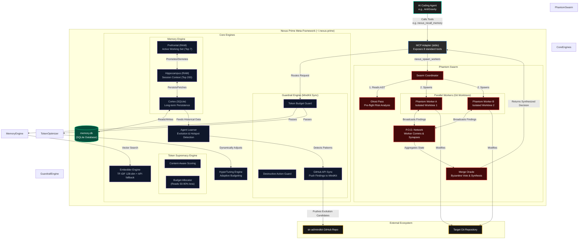

# 🧬 Nexus Prime

**The AI meta-framework that makes agents smarter about themselves.**

Nexus Prime is an MCP server that gives AI coding agents cross-session memory, token optimization, parallel sub-agent orchestration, and machine-checked guardrails — running as a background process that any agent can call as native tools.

[](LICENSE)
[](https://nodejs.org)
[](https://typescriptlang.org)
[](https://www.npmjs.com/package/nexus-prime)

---

## The Super Intellect Stack

Nexus Prime is the **runtime layer** in a 4-project ecosystem:

```
┌─────────────────────────────────────────────────┐
│  Phantom (PM)                                    │
│  "What to build" — PRDs, releases, docs         │
│  github.com/sir-ad/phantom                      │
├─────────────────────────────────────────────────┤
│  MindKit (Skills)                                │
│  "How to think" — 22 skills, guardrails, routing │
│  github.com/sir-ad/mindkit                      │
├─────────────────────────────────────────────────┤
│  Nexus Prime (OS)  ← YOU ARE HERE               │
│  "How to run" — memory, tokens, workers, POD     │
│  github.com/sir-ad/nexus-prime                  │
├─────────────────────────────────────────────────┤
│  Grain (Language)                                │
│  "How to speak" — 10 universal AI primitives     │
│  github.com/sir-ad/grain                        │
└─────────────────────────────────────────────────┘
```

---

## Why?

Every AI coding session starts cold. The agent re-reads the same files, re-discovers the same patterns, makes the same mistakes. Nexus Prime fixes this:

- **Memory persists between sessions** — findings survive restarts
- **Token usage is optimized** — agents read only what they need (50-90% savings)
- **Parallel sub-agents** explore multiple solutions simultaneously via git worktrees
- **Guardrails prevent mistakes** before code is written
- **Self-evolution** — learns from past sessions and adapts

---

## Architecture



---

## Quick Start

```bash
# Install from npm
npm install -g nexus-prime

# Or clone and build
git clone https://github.com/sir-ad/nexus-prime
cd nexus-prime
npm install
npm run build
```

### Wire into your AI agent

Add to your MCP config (AntiGravity, Claude Desktop, etc.):

```json
{
  "mcpServers": {
    "nexus-prime": {
      "command": "node",
      "args": ["/path/to/nexus-prime/dist/cli.js", "mcp"]
    }
  }
}
```

---

## The 8 MCP Tools

### Memory

| Tool | When | What |
|------|------|------|
| `nexus_store_memory` | After discoveries | Store findings, bugs, decisions. Priority 0-1. |
| `nexus_recall_memory` | Session start + mid-session | Semantic recall. Top-k memories matching query. |
| `nexus_memory_stats` | Session start | Tier counts, top tags, Zettelkasten link stats. |

### Intelligence

| Tool | When | What |
|------|------|------|
| `nexus_optimize_tokens` | Before reading 3+ files | Pre-flight reading plan. 50-90% token savings. |
| `nexus_ghost_pass` | Before modifying 3+ files | Risk analysis + worker approach suggestions. |
| `nexus_mindkit_check` | Before destructive ops | Guardrail check. PASS/FAIL with score 0-100. |

### Parallel Work

| Tool | When | What |
|------|------|------|
| `nexus_spawn_workers` | Complex multi-file refactors | Phantom Workers in isolated git worktrees. |
| `nexus_audit_evolution` | Sprint boundaries / post-bug | Find recurring patterns, file hotspots. |

---

## Memory System

Three-tier architecture modelled on human memory:

| Tier | Size | Backed by | Purpose |
|------|------|-----------|---------:|
| **Prefrontal** | 7 items | RAM | Active working set |
| **Hippocampus** | 200 items | RAM | Recent session context |
| **Cortex** | Unlimited | SQLite | Long-term persistence |

**Recall** uses hybrid scoring: TF-IDF vectors (128-dim) + priority + recency + access count.

---

## Phantom Workers

Parallel sub-agent framework using real git worktrees:

```
GhostPass (read-only analysis)
  → N PhantomWorkers (parallel, isolated git worktrees)
    → POD Network (asynchronous learning exchange)
      → MergeOracle (Byzantine vote, confidence-weighted merge)
```

Each worker gets an isolated copy of the repo. Workers broadcast findings via the **POD Network**. The `MergeOracle` evaluates outcomes by confidence score.

---

## Session Telemetry

Every MCP response includes a telemetry footer:

```
─── 📡 Nexus Prime (12s) ───
3 calls │ 20.3k tokens saved │ 2 stored │ 5 recalled │ 59 Zettel links
```

---

## Guardrails (MindKit)

6 machine-checked rules + external rules synced from [MindKit](https://github.com/sir-ad/mindkit):

| Rule | Trigger | Action |
|------|---------|--------|
| `TOKEN_BUDGET` | Context > 100k tokens | 🚫 Block |
| `TOKEN_WARN` | Context > 70k tokens | ⚠️ Warn |
| `DESTRUCTIVE_GUARD` | `isDestructive: true` | 🚫 Block |
| `BULK_FILE_GUARD` | > 10 files modified | ⚠️ Warn |
| `NO_PROD_WRITES` | `/etc`, `/usr`, `/bin` | 🚫 Block |
| `MEMORY_FIRST` | "research" / "look up" | ℹ️ Remind |

---

## Project Structure

```
nexus-prime/
├── src/
│   ├── index.ts                    # NexusPrime main class
│   ├── cli.ts                      # CLI entry (node dist/cli.js mcp)
│   ├── agents/
│   │   ├── adapters/mcp.ts         # MCP server, 8 tools + telemetry
│   │   ├── coordinator.ts          # Worker dispatch orchestration
│   │   ├── orchestrator.ts         # Context-aware agent runner
│   │   └── learner.ts              # SQL-based evolution detection
│   ├── engines/
│   │   ├── memory.ts               # Three-tier memory + queryByTags
│   │   ├── embedder.ts             # TF-IDF + optional OpenAI embeddings
│   │   ├── token-supremacy.ts      # Content-aware token optimization
│   │   ├── guardrails-bridge.ts    # GuardrailEngine + MindKit sync
│   │   └── meta-learner.ts         # HyperTuning adaptive parameters
│   └── phantom/
│       ├── index.ts                # GhostPass, PhantomWorker, MergeOracle
│       └── phase4-orchestrator.ts  # Self-built phase orchestrator
├── packages/
│   └── mindkit/                    # Standalone npm package
├── test/
│   ├── phantom.test.ts             # E2E Phantom Workers test
│   └── memory.test.ts              # Semantic recall test
├── GEMINI.md                       # Session protocol for AI agents
├── AGENTS.md                       # Agent overview
└── NEXUS.md                        # Language specification
```

---

## Configuration

| Env Var | Default | Description |
|---------|---------|-------------|
| `NEXUS_EMBED_MODE` | `local` | `local` (TF-IDF) or `api` (OpenAI-compatible) |
| `NEXUS_EMBED_URL` | — | API endpoint when mode=api |
| `NEXUS_EMBED_KEY` | — | API key when mode=api |
| `NEXUS_EMBED_MODEL` | — | Model name when mode=api |

---

## License

MIT — [sir-ad](https://github.com/sir-ad)
