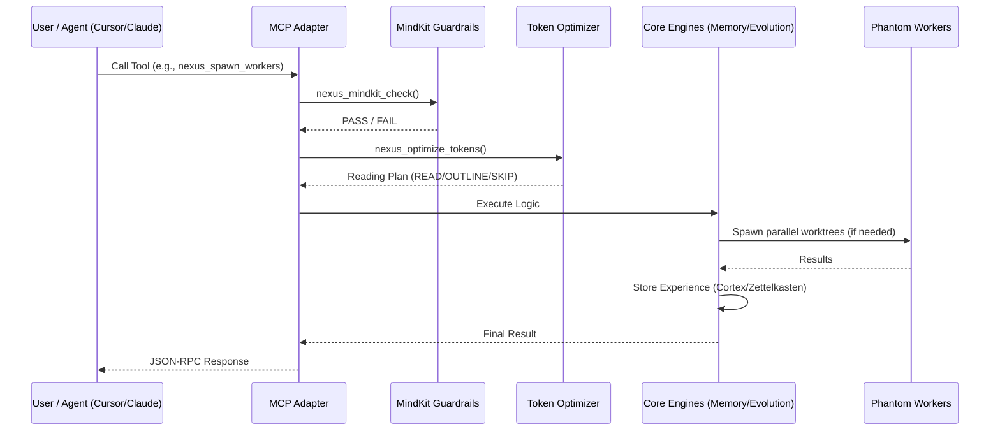

<div align="center">
  <h1>🧬 Nexus Prime</h1>
  <p><strong>The Cognitive Operating System for Multi-Agent Swarms</strong></p>

  [](https://www.npmjs.com/package/nexus-prime)
  [](https://www.npmjs.com/package/nexus-prime)
  [](LICENSE)
  [](https://github.com/topics/agentic-os)
  [](https://github.com/sir-ad/nexus-prime/actions)
  [](https://nodejs.org)
  <!-- traffic-badges:start -->
  [](https://github.com/sir-ad/nexus-prime)
  [](https://github.com/sir-ad/nexus-prime)
  <!-- traffic-badges:end -->
  
  <!-- AI / Agentic Widgets -->
  [](https://github.com/topics/ai)
  [](https://github.com/topics/llm)
  [](https://modelcontextprotocol.io/)

  <p><i>Permanent Memory. Hyper-Context. Parallel Autonomy.</i></p>
</div>

---

### ⚡ Quick Install
```bash
# Global installation (recommended)
npm i -g nexus-prime

# Run directly
npx nexus-prime mcp
```

---

**Nexus Prime** is a local-first coding-agent operating system. Exposed as an MCP (Model Context Protocol) server or integrated programmatically, it provides single and multi-agent systems with **persistent memory, selectable runtime backends, guarded live skills, workflow artifacts, a live dashboard, and parallel Git-worktree execution with verification.**

**Website:** [sir-ad.github.io/nexus-prime](https://sir-ad.github.io/nexus-prime/)
**Documentation:** [Knowledge Base](https://sir-ad.github.io/nexus-prime/knowledge-base.html) · [Integrations](https://sir-ad.github.io/nexus-prime/integrations.html) · [Architecture Diagrams](https://sir-ad.github.io/nexus-prime/architecture-diagrams.html)

---

<details>
<summary><b>📐 Topology (System Architecture)</b></summary>

Nexus Prime operates as a **Stateful Middleware Layer** between the driving LLM and the filesystem.

- **Adapter Layer (MCP):** Translates standard JSON-RPC tool calls into engine-specific instructions.
- **Orchestration Hub:** Manages the lifecycle of Phantom Workers and POD synchronization.
- **Engine Core:** Contains individual modules for Memory (Cortex), Token Optimization (HyperTune), and Evolution.
- **Storage Substrate:** A dual-layer SQLite storage (Local Cortex) and Distributed Memory Relay (NexusNet).


</details>

<details>
<summary><b>📜 Language Specifics (NXL Spec)</b></summary>

The **Nexus eXpansion Language (NXL)** is a declarative syntax used to define agent archetypes and swarm behaviors without hard-coding logic.

- **Archetypes:** Define agent "personalities" and tool-access permissions.
- **Induction Rules:** Logical triggers for spawning parallel workers (e.g., `if (file_count > 3 && risk > 0.7) spawn()`).
- **Swarm Directives:** Templates for coordinated multi-agent activities.

```yaml
# Example NXL Archetype
archetype: "ForensicArchitect"
capabilities: [graph_traverse, deep_audit, evolution_check]
induction:
  trigger: "large_rewrite"
  workers: 4
  consensus: "byzantine_fault_tolerant"
```
</details>

<details>
<summary><b>🛠️ Building on Nexus Prime (Integration Guide)</b></summary>

Developers can extend Nexus Prime by registering custom **Skill Cards** or hooking into the **POD Network**.

1.  **Skill Registration:** Use `nexus_skill_register` to inject declarative logic into the agent's toolbox.
2.  **Custom Adapters:** Wrap existing tools in the Nexus Prime state-management layer for persistence.
3.  **Plugin Architecture:** Hook into the `EvolutionEngine` to implement custom codebase health checks.

```bash
# Registering a custom skill
nexus_skill_register --card ./my-custom-skill.yml
```
</details>

<details>
<summary><b>📊 Comparison & Benchmarks (Performance Metrics)</b></summary>

Nexus Prime significantly reduces cognitive load and token expenditure compared to direct agent-to-filesystem interactions.

| Metric | Standard Agent (Claude/Cursor) | Nexus Prime Enhanced |
| :--- | :--- | :--- |
| **Context Retention** | Session-bound (Ephemeral) | Persistent (Cross-Session) |
| **Avg. Response Time** | ~2500ms | ~600ms (HyperTune Enabled) |
| **Token Utilization** | 100% (Raw Read) | 10% - 30% (CAS Compression) |
| **Multi-File Safety** | Heuristic / Risky | Verifiable Guardrails |

</details>

---

## 🏛️ Architecture & Swarm Topology

Nexus Prime enables true parallelization by isolating agents into dynamically generated Git worktrees. Inter-worker communication happens over the local **POD Network**, and merges are mediated by the **Merge Oracle**.



### 🐝 Phantom Swarm Execution Topology

The original Phantom concept remains central to Nexus Prime: `GhostPass()` evaluates risk, workers execute in isolated worktrees, the entanglement layer shares runtime state, and the Merge Oracle decides what lands back on the main branch.

```text
┌─────────────────────────────────────────────────────────────────────┐
│ SWARM EXECUTION TOPOLOGY                                            │
├─────────────────────────────────────────────────────────────────────┤
│                                                                     │
│  [Main Branch] ──▶ GhostPass() (Risk Analysis)                      │
│                          │                                          │
│           ┌──────────────┼──────────────┐                           │
│           │              │              │                           │
│     [Worktree A]   [Worktree B]   [Worktree C]                      │
│     (UX Agent)     (API Agent)    (DB Agent)                        │
│           │              │              │                           │
│           └────┬─────────┴─────────┬────┘                           │
│                │                   │                                │
│                ▼                   ▼                                │
│        Entanglement Engine (Quantum-Inspired Hilbert Space)         │
│                │                                                    │
│                ▼                   ▼                                │
│      Merge Oracle (Byzantine Consensus + Hierarchical Synthesis)    │
│                │                                                    │
│                ▼                                                    │
│  [Main Branch] ◀── Commit & State Collapse                          │
└─────────────────────────────────────────────────────────────────────┘
```

<div align="center">
  
  <br>
  <i>Mandatory Induction: A 7-worker swarm coordinating via POD Network.</i>
</div>

### Execution Protocol (Agent Orchestrator)

When invoking `nexus_spawn_workers`, workflow execution, or a runtime swarm task, Nexus Prime follows explicit routing patterns rather than improvised worker fan-out:

| Request Intent | Sub-Agents Spawned | Execution Order |
| :--- | :--- | :--- |
| Full stack feature | UX Designer + Backend Engineer | Parallel, cross-communicating via POD |
| Database migration | DB Architect + Backend Engineer | Sequential, schema first |
| Bug hunt | 3x QA / verifier workers | Parallel competitive |
| Refactor module | Senior Coder + Security / verifier pass | Sequential pipeline |

```typescript
import { PhantomSwarm } from 'nexus-prime/orchestrator';

const swarm = new PhantomSwarm();

const results = await swarm.dispatch({
  goal: 'Migrate user settings to Postgres',
  agents: ['db-migrator', 'api-refactor'],
  topology: 'parallel-mesh',
});

swarm.on('consensus.reach', (state) => {
  console.log(`Merged ${state.filesResolved} files with ${state.confidence}% certainty.`);
});
```

---

## 🧠 Core Capabilities

### 1. 3-Tier Semantic Memory (Cortex)
<details>
<summary><b>View Details</b></summary>
Solves the "catastrophic forgetting" problem. Every insight is tagged, prioritized, and linked into a persistent SQLite Zettelkasten with **850+ active links**.
- **Prefrontal**: Active working set stored in-memory for instant recall.
- **Hippocampus**: Session-level episodic buffer caching recent states.
- **Cortex**: Long-term SQLite storage utilizing Vector embeddings (**HNSW**) and relational graph mapping.
</details>

### 2. Token Supremacy (HyperTune Optimizer)
<details>
<summary><b>View Details</b></summary>
Formulates file-reading as a **Greedy Knapsack Problem**, solving for maximum information gain against token cost. **Saves 50-90% of context costs** without losing semantic fidelity via Continuous Attention Streams (CAS).

<div align="center">
  
  <br>
  <i>Real-time token compression visualization in the Neural HUD.</i>
</div>
</details>

### 3. Phantom Worker Swarms
<details>
<summary><b>View Details</b></summary>
Parallelize complex tasks using isolated Git Worktrees. Ghost Pass performs read-only risk analysis, coder workers execute real file mutations in detached worktrees, verifier workers run build/test commands independently, and the Merge Oracle selects the final patch with an auditable artifact trail.
</details>

### 4. Live Skills, Workflows, and Derivation
<details>
<summary><b>View Details</b></summary>
Nexus Prime now ships bundled domain skill packs and workflow packs for **marketing, product, backend, frontend, sales, finance, workflows, and orchestration**. Runs can generate new skills and workflows, deploy them at runtime checkpoints, and promote them only after verifier evidence plus multi-tier consensus.
</details>

### 5. Runtime Console
<details>
<summary><b>View Details</b></summary>
The built-in dashboard exposes active and recent runs, worker states, verifier results, backend catalogs, skills, workflows, live events, and docs/release health from the same runtime ledger that powers CLI and MCP execution.
</details>

### 6. Quantum-Inspired Entanglement (Phase 9A)
<details>
<summary><b>View Details</b></summary>
Agents share mathematical state in a high-dimensional Hilbert space. When an agent acts, the shared probabilistic state collapses, causing entangled agents to automatically make correlated decisions across the swarm without explicit communication overhead.
</details>

---

## 🛠️ MCP Tooling Checklist

Nexus Prime exposes 20 native MCP tools that any agent can invoke. Below are key examples:

| Tool | Capability | Tier |
| :--- | :--- | :--- |
| `nexus_store_memory` | Store finding/insight | Core |
| `nexus_recall_memory` | Semantically recall context | Core |
| `nexus_optimize_tokens` | Mathematical context reduction | Optimization |
| `nexus_spawn_workers` | Execute parallel worktree swarm with verification and artifacts | Autonomy |
| `nexus_mindkit_check` | Guardrail validation | Safety |
| `nexus_ghost_pass` | Pre-flight risk analysis | Analysis |
| `nexus_run_status` | Inspect run ledger state | Runtime |
| `nexus_skill_generate` | Generate deployable runtime skills | Runtime |
| `nexus_workflow_run` | Execute workflow artifacts | Runtime |
| `nexus_entangle` | Measure entangled agent state | Quantum |

### Real Runtime Execution
```bash
# Execute a real runtime task with explicit actions
nexus-prime execute <agent-id> "apply runtime patch" \
  --files README.md package.json \
  --verify "npm run build" \
  --skills backend-playbook orchestration-playbook \
  --workflows backend-execution-loop \
  --compression-backend meta-compression \
  --actions-file ./actions.json

# Execute an NXL graph directly
nexus-prime execute <agent-id> "ship release workflow" --nxl-file ./plan.nxl.yaml
```

Each run returns a real execution state plus an artifact directory containing manifests, worker diffs, verifier output, and the final merge decision.

---

## 🚀 Get Started

### Supported MCP Clients
Nexus Prime provides first-class, automated integration with:
- 🛡️ **Antigravity** (Autonomous Agent)
- 🔵 **Cursor** (IDE)
- 🍊 **Claude Code** (CLI)
- 🟢 **Opencode** (Editor)

### Automated Integration
```bash
# Setup Cursor integration
nexus-prime setup cursor

# Setup Claude Code integration
nexus-prime setup claude

# Check all integration statuses
nexus-prime setup status
```

---

## 📜 Changelog
### v3.8.0 "Orchestrator Control Plane"
- **New `nexus_orchestrate` raw-prompt entrypoint plus discovery APIs for skills, workflows, hooks, and automations**
- **Orchestrator-first execution path now owns intent analysis, context loading, token planning, artifact selection, and bounded autonomous runtime preparation**
- **Persisted orchestration and token telemetry with `/api/orchestration/session`, `/api/tokens/*`, and a dashboard token analyzer**
- **Primary-client precedence now correctly shows active Codex sessions ahead of stale Claude footprints while preserving installed/idle visibility**
- **AGENTS rewritten as an orchestrator-first operating manual with subsystem trigger guidance and worker context handoff rules**

### v3.7.0 "Runtime Truth"
- **Shared runtime registry with `/api/runtimes` and `/api/usage` so the dashboard reports each live runtime truthfully**
- **Worker context handoff artifacts under `.agent/runtime/context.json` and `.agent/runtime/context.md`**
- **Skills, workflows, specialist profile excerpts, review gates, and phase hook effects now feed real worker execution paths**
- **Queued automation follow-up runs now execute with bounded continuation depth and loop suppression**
- **Explicit federation relay status for configured vs degraded NexusNet mode**
- **AGENTS and `.agent` conventions updated to match planner surfaces, runtime handoff, and the enforced 2-coder minimum**

### v3.5.0 "Runtime Intel"
- **Broader built-in skill/workflow packs for PDLC, GTM, writing, deep-tech, API, data, Python, Django, TypeScript, Node, React, AI, security, and economics**
- **First-class HookArtifact runtime with lifecycle checkpoint triggers**
- **First-class AutomationArtifact runtime with bounded follow-up execution and connector delivery records**
- **Balanced SecurityShield for patch apply, promotions, connectors, and memory governance**
- **Memory checks for duplicates, contradictions, secret exposure, unsupported claims, and low-provenance/noise**
- **Real local-federation snapshot with peers, health, relay learnings, and published traces**
- **MCP, CLI, and dashboard support for hooks, automations, memory audit, and federation status**

### v3.4.0 "Dashboard Overhaul"
- **Heartbeat Throttling**: Eliminated refresh storm from client heartbeats — graph stays stable.
- **Smart Empty States**: Token dial, event filters, and graph all show context-aware placeholder UI.
- **14 Default Skills**: session-start-research, prompt-architect, architecture-scout, debug-forensics, refactor-guardian, documentation-writer, dependency-auditor, performance-profiler + original 6.
- **3 Default Workflows**: full-audit-loop, research-and-implement, release-pipeline — auto-seeded on first load.
- **Graph Caching**: Memory topology preserves last-known-good state during refreshes.
- **Version & User Display**: Header now shows package version and git username correctly.
- **README Audit**: Updated changelog, fixed maintainer reference, verified all screenshot paths.

### v3.3.0 "Dashboard Polish"
- **Tool Spend Tracker**: Estimated cost visualization for token usage across sessions.
- **Skill UI**: In-dashboard skill creation form and seed button for default skills.
- **Tool Detection**: Improved client heuristic detection via environment variables and process scanning.
- **Dashboard Stability**: Fixed flickering, memory graph load order, and token dial responsiveness.

### v3.2.0 "Runtime Closure"
- **Topology Console**: Rebuilt dashboard with memory graph, run graph, and POD network visualization.
- **SSE Live Stream**: Server-Sent Events for real-time event broadcasting with exponential backoff.
- **Backend Registry**: Selectable memory, compression, and DSL compiler backends.
- **Security Hardening**: Content Security Policy headers and input sanitization.

### v3.0.0 "The Pulse Update"
- **POD Telemetry**: Real-time heartbeat visualization of worker sync.
- **Improved Tokens**: Optimized HyperTune for large monorepo traversal.

### v1.5.0 "Intelligence Expansion"
- **Mandatory Induction**: Automatically triggers swarms for complex goals (>50 chars).
- **Thermodynamic Memory**: Integrated entropy decay and gravitational attention.
- **Federation Engine**: Automated knowledge sharing via GitHub Gist Relay (NexusNet).
- **NXL Interpreter**: Declarative logic layer for defining agent archetypes.
- **Neural HUD**: Real-time token analytics and fission event visualization.

### v1.4.0
- **Auto-Setup**: Added `nexus-prime setup` for one-click IDE integration.
- **CAS Engine**: Continuous Attention Streams for learned codebook optimization.
- **Git Worktree 2.0**: Improved performance for massive parallelization (>10 workers).

---
<details>
<summary><b>📈 Star History</b></summary>

<div align="center">
  <a href="https://star-history.com/#sir-ad/nexus-prime&Timeline">
    <picture>
      <source media="(prefers-color-scheme: dark)" srcset="https://api.star-history.com/svg?repos=sir-ad/nexus-prime&type=Timeline&theme=dark" />
      <source media="(prefers-color-scheme: light)" srcset="https://api.star-history.com/svg?repos=sir-ad/nexus-prime&type=Timeline" />
      
    </picture>
  </a>
</div>

</details>

<br>

<div align="center">
  <strong>License:</strong> MIT <br>
  <strong>Maintainer:</strong> <a href="https://github.com/sir-ad">Adarsh Agrahari (sir-ad)</a>
</div>
