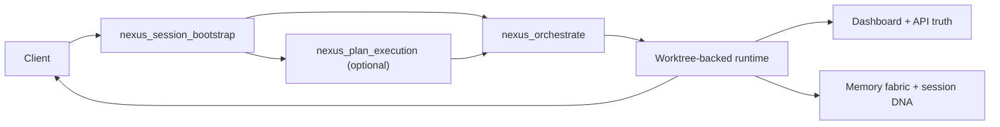
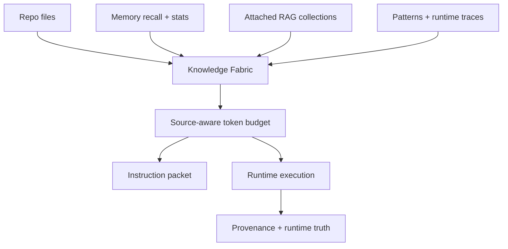
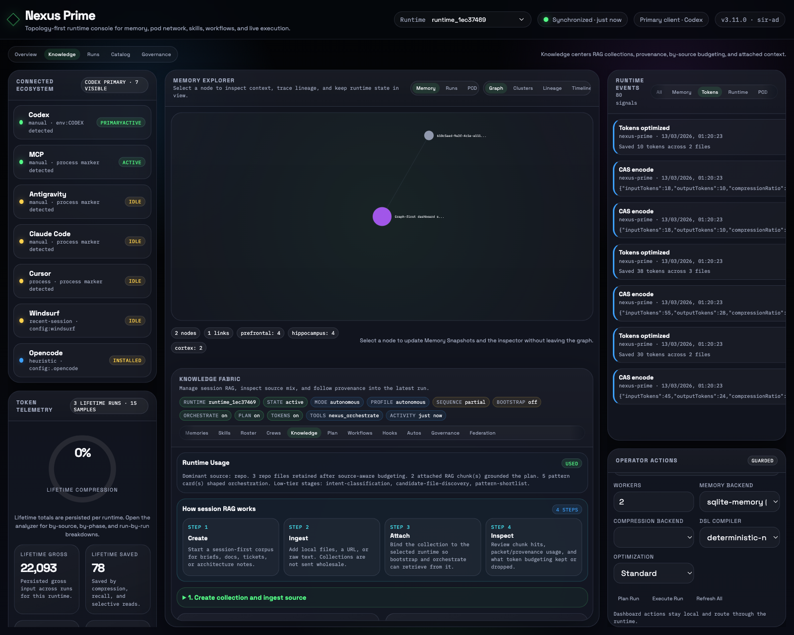

<div align="center">
  <h1>🧬 Nexus Prime</h1>
  <p><strong>Local-first MCP control plane for coding agents</strong></p>

  [](https://www.npmjs.com/package/nexus-prime)
  [](https://www.npmjs.com/package/nexus-prime)
  [](LICENSE)
  [](https://github.com/topics/agentic-os)
  [](https://github.com/sir-ad/nexus-prime/actions)
  [](https://nodejs.org)
  <!-- traffic-badges:start -->
  [](https://github.com/sir-ad/nexus-prime)
  [](https://github.com/sir-ad/nexus-prime)
  <!-- traffic-badges:end -->

  <!-- AI / Agentic Widgets -->
  [](https://github.com/topics/ai)
  [](https://github.com/topics/llm)
  [](https://modelcontextprotocol.io/)
  
  <p><i>Bootstrap. Orchestrate. Verify. Learn.</i></p>
  <a href="https://www.producthunt.com/products/nexus-prime?embed=true&amp;utm_source=badge-featured&amp;utm_medium=badge&amp;utm_campaign=badge-nexus-prime" target="_blank" rel="noopener noreferrer"></a>

</div>

---

**Nexus Prime** is a local-first MCP control plane for coding agents. It gives clients a default path that starts with bootstrap context, flows through orchestrated execution, and ends with persisted runtime truth instead of ad-hoc tool chaining.

**Website:** [sir-ad.github.io/nexus-prime](https://sir-ad.github.io/nexus-prime/)<br>
**Documentation:** [Catalog](https://sir-ad.github.io/nexus-prime/catalog.html) · [Knowledge Base](https://sir-ad.github.io/nexus-prime/knowledge-base.html) · [Integrations](https://sir-ad.github.io/nexus-prime/integrations.html) · [Architecture Diagrams](https://sir-ad.github.io/nexus-prime/architecture-diagrams.html)

## What Nexus Prime is

Nexus Prime sits between the client and the repo so the client does not have to improvise session recovery, context selection, worker shape, verification, or memory handoff.

What that means in practice:

- **Bootstrap-first execution** so non-trivial work starts with memory, stats, catalog health, source mix, and the recommended next step.
- **Orchestrator-first runtime** so the public path is one raw prompt into `nexus_orchestrate`, not a manual chain of low-level tools.
- **Worktree-backed execution** with explicit verifier lanes, worktree health, and runtime ledgers.
- **Session-first RAG** where attached collections are gated, retrieved, budgeted, and traced instead of dumped into prompts wholesale.
- **Persisted runtime truth** so the dashboard reflects runtime snapshots, not whichever process happens to host the UI.
- **Lifetime token telemetry** so compression, by-source allocation, and drop decisions survive restart.

## Why it is different

| Concern | Direct agent-to-filesystem flow | Nexus Prime flow |
| :--- | :--- | :--- |
| Session start | Depends on repo docs and ad-hoc browsing | `nexus_session_bootstrap` recovers memory, catalog health, source mix, and the recommended next step |
| Multi-step execution | Manual tool chaining | `nexus_orchestrate` decomposes, scores assets, budgets tokens, executes, verifies, and records truth |
| Token discipline | Caller-managed | Source-aware token budgeting records what was selected, dropped, and forwarded |
| RAG | Often bolted on as prompt stuffing | Runtime-attached collections are gated, retrieved, and traced into packet/provenance |
| Runtime truth | Depends on the active host process | Shared runtime snapshots back the dashboard and API surfaces |
| Follow-up learning | Optional and easy to skip | Session DNA, memory reconciliation, and execution ledgers are first-class outputs |

## ⚡ Quick Install

```bash
# Global installation (recommended)
npm i -g nexus-prime

# Start the MCP server
npx nexus-prime mcp
```

Home-scoped bootstrap now runs automatically on install or first binary start, and the first Nexus run inside a repo writes the workspace-scoped client files it needs. `nexus-prime setup <client>` and `nexus-prime setup all` remain the explicit refresh/fix path when you want to force regeneration.

## Default bootstrap-orchestrate path

```txt
nexus_session_bootstrap(goal="<task>", files=[...])
nexus_orchestrate(prompt="<raw user request>")
```

Use `nexus_plan_execution` only when you explicitly want the ledger before mutation. Let Nexus choose crews, specialists, skills, workflows, hooks, automations, worker count, and token strategy unless you need hard constraints.

## Proof Screens

<div align="center">
  
  <br>
  <i>Graph-centered cockpit view: the dashboard keeps memory context, runtime truth, and operator controls in one place instead of hiding them behind separate tools.</i>
</div>

- [Catalog](https://sir-ad.github.io/nexus-prime/catalog.html): generated registry for MCP surfaces, client targets, dashboard capabilities, runtime subsystems, and release gates.
- [Knowledge Base](https://sir-ad.github.io/nexus-prime/knowledge-base.html): runtime contract, packets, ledgers, memory, token telemetry, and guardrails.
- [Integrations](https://sir-ad.github.io/nexus-prime/integrations.html): verified setup for Codex, Cursor, Claude Code, Opencode, Windsurf, and Antigravity/OpenClaw.
- [Architecture Diagrams](https://sir-ad.github.io/nexus-prime/architecture-diagrams.html): shipped diagrams for the control plane, worktree lifecycle, memory fabric, RAG gate, token budget, runtime truth, and release pipeline.

## 🧠 Core Capabilities

### 1. Session Bootstrap and Orchestration
- **Outcome:** external clients start from one disciplined path instead of a tool buffet.
- **How:** `nexus_session_bootstrap` recovers context and `nexus_orchestrate` owns decomposition, asset selection, execution, and verification.
- **Proof:** runtime ledgers, worker plans, and selection audits are persisted into runtime truth.

### 2. Worktree-Backed Swarms and Verification
- **Outcome:** multi-file work can fan out without polluting the main checkout.
- **How:** coder and verifier lanes execute in isolated worktrees with an explicit worktree-health pass before creation.
- **Proof:** the runtime records worktree health, degraded fallback, verifier status, and merge/apply outcomes.

### 3. Memory Fabric and Reconciliation
- **Outcome:** memories stay useful instead of becoming a raw transcript dump.
- **How:** the memory control plane applies fact extraction, reconciliation, quarantine, portability, and vault projection on top of the SQLite + graph base.
- **Proof:** the dashboard exposes memory health, scope, trace, and shared-worker context.

### 4. Session-First RAG Gate
- **Outcome:** attached corpora help when relevant without flooding prompts.
- **How:** collections are attached to the runtime, retrieved only when relevant, and traced into planner, packet, and provenance.
- **Proof:** the knowledge view records attached, retrieved, selected, and dropped context.

### 5. Source-Aware Token Budgeting
- **Outcome:** context selection becomes a budgeted routing problem instead of “read everything.”
- **How:** Nexus budgets across repo, memory, RAG, patterns, and runtime traces, then persists what was selected and what was dropped.
- **Proof:** lifetime token telemetry, by-source allocation, and per-run drilldowns survive restart.

### 6. Runtime Truth and Dashboard
- **Outcome:** operators can inspect what actually happened in the runtime without trusting live-only host state.
- **How:** packets, ledgers, token summaries, client bootstrap truth, worktree health, and run snapshots all come from persisted runtime state.
- **Proof:** the dashboard shows graph-first context, execution history, governance, and catalog truth from the same runtime ledger.

### 7. Client Bootstrap and MCP Profiles
- **Outcome:** users do not have to manually copy bootstrap files for every client.
- **How:** install/start establishes home-scoped surfaces, first repo run writes workspace-scoped surfaces, and `setup all` remains the explicit repair path.
- **Proof:** Codex, Cursor, Claude Code, Opencode, Windsurf, and Antigravity/OpenClaw all have generated bootstrap targets.

### 8. Release and Governance Surfaces
- **Outcome:** the product story and the ship path stay aligned.
- **How:** feature registry generation, public-surface scans, release smoke, dependency audit, and runtime smoke all sit in the release gate.
- **Proof:** README, docs, dashboard catalog, and release notes all consume the same generated inventory.

<details>
<summary><b>📐 Diagram: bootstrap → orchestrate → runtime → truth</b></summary>



</details>

<details>
<summary><b>🧠 Diagram: memory + RAG + token-budget flow</b></summary>



</details>

<details>
<summary><b>🚢 Diagram: repo change → QA gate → GitHub release → npm publish</b></summary>


</details>

<div align="center">
  
  <br>
  <i>Knowledge and token trace view: Nexus shows what attached collections contributed, what token budgeting kept, and what the runtime dropped.</i>
</div>

## 🚀 Client Setup and Runtime Contract

### Supported MCP Clients
Nexus Prime currently provides automated setup for:
- 🔴 **Codex**
- 🔵 **Cursor**
- 🍊 **Claude Code**
- 🟢 **Opencode**
- 🌊 **Windsurf**
- 🛡️ **Antigravity / OpenClaw**

Codex now has a first-class setup path too: `nexus-prime setup codex` creates or updates a managed Nexus Prime bootstrap block inside the repo-local `AGENTS.md`. Manual copying is no longer required; Nexus also auto-establishes home-scoped bootstrap on install/start and writes workspace-scoped client files on first repo run.

### Automated Integration
```bash
nexus-prime setup codex
nexus-prime setup cursor
nexus-prime setup claude
nexus-prime setup windsurf
nexus-prime setup antigravity
nexus-prime setup all
nexus-prime setup status
```

### Runtime contract

```txt
1. nexus_session_bootstrap(goal, files?)
2. nexus_orchestrate(prompt)
3. Persist packet, ledger, token telemetry, provenance, and session DNA
4. Inspect runtime truth in the dashboard or via MCP
```

### Operator-facing proof

```txt
Called Nexus Session Bootstrap tool from Nexus Prime MCP

Session bootstrap ready.
- Client: Codex (primaryActive)
- Recommended next step: nexus_orchestrate
- Token optimization: required
- Knowledge fabric: repo
```

```txt
Called Nexus Memory Stats tool from Nexus Prime MCP

Memory inventory ready.
- Prefrontal: working set
- Hippocampus: recent session buffer
- Cortex: durable long-term store
- Zettelkasten links: persisted graph relationships
```

<!-- feature-registry:start -->
<details>
<summary><b>🧭 Platform Feature Registry</b></summary>

Generated from shared feature metadata at 2026-03-14T13:10:06.287Z.

Inventory Snapshot: 109 skills · 64 workflows · 5 hooks · 3 automations · 7 crews · 139 specialists

Control Plane Snapshot: 9 MCP surfaces · 6 client targets · 5 dashboard capabilities · 6 runtime subsystems · 5 release gates

<details>
<summary><b>MCP Surfaces</b> (9)</summary>

Operator-facing entrypoints and expert control surfaces.

| Name | Surface | Purpose | Notes |
| --- | --- | --- | --- |
| nexus_session_bootstrap | core MCP | Recover session context, memory stats, catalog health, and next-step guidance. | Default first call for non-trivial work. |
| nexus_orchestrate | core MCP | Plan, select assets, execute through worktree-backed runtime, and persist truth. | Default raw-prompt execution path. |
| nexus_plan_execution | planning MCP | Inspect the planner ledger before mutation. | Used when operators want a pre-run ledger. |
| nexus_recall_memory / nexus_memory_stats / nexus_store_memory | memory MCP | Inspect and persist durable learnings. | Feeds the memory fabric and handoff flow. |
| nexus_optimize_tokens | optimization MCP | Inspect or override source-aware token budgeting. | Manual/diagnostic surface; orchestration applies budgeting automatically. |
| nexus_mindkit_check / nexus_ghost_pass / nexus_spawn_workers | safety + runtime MCP | Run governance preflight, pre-read analysis, and explicit swarm control. | Expert or low-level surfaces. |
| nexus_memory_export / import / backup / maintain / trace | memory portability MCP | Export, restore, maintain, and inspect local-first memory bundles. | Supports backup/resume and OpenClaw-oriented bridge packs. |
| nexus_list_skills / workflows / hooks / automations / specialists / crews | catalog MCP | Expose what the runtime can activate. | Used for explicit operator control and diagnostics. |
| nexus_run_status / nexus_federation_status / nexus_session_dna | runtime truth MCP | Inspect persisted run state, federation status, and handoff DNA. | Used after execution or during operating-layer work. |

</details>

<details>
<summary><b>Client Bootstrap Targets</b> (6)</summary>

Client-native installation and bootstrap surfaces managed by Nexus Prime.

| Name | Surface | Purpose | Notes |
| --- | --- | --- | --- |
| Codex | bootstrap target | Writes a managed Nexus Prime block into repo-local AGENTS.md. | Workspace-scoped bootstrap. |
| Cursor | bootstrap target | Installs MCP config plus project-local .cursor/rules/nexus-prime.mdc. | Home + workspace surfaces. |
| Claude Code | bootstrap target | Installs MCP config plus generated markdown bootstrap note. | Project note under .agent/client-bootstrap. |
| Opencode | bootstrap target | Installs config plus generated markdown bootstrap note. | Project note under .agent/client-bootstrap. |
| Windsurf | bootstrap target | Installs MCP config plus .windsurfrules. | Workspace-scoped rule surface. |
| Antigravity / OpenClaw | bootstrap target | Installs MCP config plus split SKILL.md bundles sized to client limits. | Home-scoped skill bundle. |

</details>

<details>
<summary><b>Dashboard Capabilities</b> (5)</summary>

What the topology console exposes from persisted runtime truth.

| Name | Surface | Purpose | Notes |
| --- | --- | --- | --- |
| Overview | dashboard | Runtime truth, lifetime token telemetry, graph-centered memory view, and system signals. | Default operator cockpit. |
| Knowledge | dashboard | Session-first RAG workflow, provenance, source mix, and bootstrap manifest truth. | Shows attached, retrieved, selected, and dropped context. |
| Runs | dashboard | Execution topology, verifier traces, and event stream. | Centered on persisted runtime snapshots. |
| Catalog | dashboard | Loaded assets, feature registry, and runtime-vs-available inventory. | Separates what exists from what was used. |
| Governance | dashboard | Guardrails, quarantine, federation health, and client bootstrap drift. | Operator-facing trust layer. |

</details>

<details>
<summary><b>Runtime Subsystems</b> (7)</summary>

Core architecture layers that shape execution, memory, and visibility.

| Name | Surface | Purpose | Notes |
| --- | --- | --- | --- |
| Knowledge Fabric | runtime subsystem | Balances repo, memory, RAG, patterns, and runtime traces into one execution bundle. | Feeds planner, packet, and worker context. |
| Memory Control Plane | runtime subsystem | Reconciles facts with add/update/merge/delete/quarantine semantics and vault projection. | Local-first memory remains inspectable and portable. |
| Worktree Doctor | runtime subsystem | Prunes stale git worktree metadata and records worktree health ahead of execution. | Protects nexus_orchestrate and verifier lanes from stale temp state. |
| Source-Aware Token Budget | runtime subsystem | Allocates token budget across repo, memory, RAG, patterns, and runtime traces. | Persists selected and dropped context. |
| Bootstrap Manifest Truth | runtime subsystem | Tracks configured client bootstrap artifacts independently from active heartbeats. | Supports installed vs active truth in the dashboard. |
| Artifact Selection Audit | runtime subsystem | Explains why skills/workflows/crews/specialists were selected or rejected. | Persists auditable selection rationale. |
| Bundled assets: 109 skills · 64 workflows · 5 hooks · 3 automations · 7 crews · 139 specialists | runtime subsystem | Summarizes the current bundled runtime inventory. | Detailed lists live in the runtime catalog section and dashboard catalog view. |

</details>

<details>
<summary><b>Release Gates</b> (5)</summary>

Quality and security checks required before release.

| Name | Surface | Purpose | Notes |
| --- | --- | --- | --- |
| Build + lint + tests | release gate | Compile, lint, and validate runtime/docs/public surfaces. | Canonical quality matrix. |
| Package smoke | release gate | Verify npm packaging via dry-run before publish. | Catches release surface drift. |
| Dependency audit + SBOM | release gate | Track shipping dependency risk and document exceptions. | Security hardening gate. |
| Workflow lint | release gate | Validate workflow syntax and release automation contracts. | Protects CI/CD drift. |
| Runtime smoke | release gate | Exercise MCP startup, setup-all bootstrap, and dashboard boot. | Final operator-facing release check. |

</details>

</details>
<!-- feature-registry:end -->
---
<!-- runtime-catalog:start -->
<details>
<summary><b>🗂 Runtime Catalog</b></summary>

Generated from bundled runtime catalogs plus repo-local overrides via `npm run generate:readme-catalog`.

Inventory Snapshot: 109 skills · 64 workflows · 5 hooks · 3 automations · 7 crews

<details>
<summary><b>Skills</b> (109)</summary>

| Name | Type/Scope | Purpose | Trigger / When used |
| --- | --- | --- | --- |
| Agent Orchestrator | read · base | 🛰️ Agent Orchestrator | orchestration work or explicit selection |
| AI Lead | read · base | 🤖 AI Lead | ai work or explicit selection |
| ai-builder | mutate · base | Operate as the ai builder with bounded mutations and verifier discipline. | ai work or explicit selection |
| ai-playbook | orchestrate · base | Operate as the ai specialist for this run. | ai work or explicit selection |
| ai-reviewer | read · base | Review ai outputs for accuracy, credibility, and completeness. | ai work or explicit selection |
| api-builder | orchestrate · base | Operate as the api builder with bounded mutations and verifier discipline. | api work or explicit selection |
| api-playbook | orchestrate · base | Operate as the api specialist for this run. | api work or explicit selection |
| api-reviewer | read · base | Review api outputs for accuracy, credibility, and completeness. | api work or explicit selection |
| Backend Inspector | read · base | ⚙️ Backend Inspector | backend work or explicit selection |
| backend-builder | mutate · base | Operate as the backend builder with bounded mutations and verifier discipline. | backend work or explicit selection |
| backend-playbook | orchestrate · base | Operate as the backend specialist for this run. | backend work or explicit selection |
| backend-reviewer | read · base | Review backend outputs for accuracy, credibility, and completeness. | backend work or explicit selection |
| Business Analyst | read · base | 📊 Business Analyst | runtime selection or explicit skill selection |
| CLI/Node Reviewer | read · base | 📟 CLI/Node Reviewer | node work or explicit selection |
| Code Review Agent | read · base | 🔍 Code Review Agent | orchestration work or explicit selection |
| Context Manager | read · base | 📦 Context Manager | runtime selection or explicit skill selection |
| CTO/CEO Strategy | read · base | 👔 CTO/CEO Strategy | strategy work or explicit selection |
| data-builder | orchestrate · base | Operate as the data builder with bounded mutations and verifier discipline. | data work or explicit selection |
| data-playbook | orchestrate · base | Operate as the data specialist for this run. | data work or explicit selection |
| data-reviewer | read · base | Review data outputs for accuracy, credibility, and completeness. | data work or explicit selection |
| deep-tech-builder | orchestrate · base | Operate as the deep-tech builder with bounded mutations and verifier discipline. | deep-tech work or explicit selection |
| deep-tech-playbook | orchestrate · base | Operate as the deep-tech specialist for this run. | deep-tech work or explicit selection |
| deep-tech-reviewer | read · base | Review deep-tech outputs for accuracy, credibility, and completeness. | deep-tech work or explicit selection |
| design-builder | orchestrate · base | Operate as the design builder with bounded mutations and verifier discipline. | design work or explicit selection |
| design-playbook | orchestrate · base | Operate as the design specialist for this run. | design work or explicit selection |
| design-reviewer | read · base | Review design outputs for accuracy, credibility, and completeness. | design work or explicit selection |
| DevOps Auditor | read · base | 🚀 DevOps Auditor | runtime selection or explicit skill selection |
| django-builder | mutate · base | Operate as the django builder with bounded mutations and verifier discipline. | django work or explicit selection |
| django-playbook | orchestrate · base | Operate as the django specialist for this run. | django work or explicit selection |
| django-reviewer | read · base | Review django outputs for accuracy, credibility, and completeness. | django work or explicit selection |
| economics-builder | orchestrate · base | Operate as the economics builder with bounded mutations and verifier discipline. | economics work or explicit selection |
| economics-playbook | orchestrate · base | Operate as the economics specialist for this run. | economics work or explicit selection |
| economics-reviewer | read · base | Review economics outputs for accuracy, credibility, and completeness. | economics work or explicit selection |
| finance-builder | orchestrate · base | Operate as the finance builder with bounded mutations and verifier discipline. | finance work or explicit selection |
| finance-playbook | orchestrate · base | Operate as the finance specialist for this run. | finance work or explicit selection |
| finance-reviewer | read · base | Review finance outputs for accuracy, credibility, and completeness. | finance work or explicit selection |
| Frontend Auditor | read · base | 🖥️ Frontend Auditor | frontend work or explicit selection |
| frontend-builder | mutate · base | Operate as the frontend builder with bounded mutations and verifier discipline. | frontend work or explicit selection |
| frontend-playbook | orchestrate · base | Operate as the frontend specialist for this run. | frontend work or explicit selection |
| frontend-reviewer | read · base | Review frontend outputs for accuracy, credibility, and completeness. | frontend work or explicit selection |
| game-development-builder | mutate · base | Operate as the game-development builder with bounded mutations and verifier discipline. | game-development work or explicit selection |
| game-development-playbook | orchestrate · base | Operate as the game-development specialist for this run. | game-development work or explicit selection |
| game-development-reviewer | read · base | Review game-development outputs for accuracy, credibility, and completeness. | game-development work or explicit selection |
| gtm-builder | orchestrate · base | Operate as the gtm builder with bounded mutations and verifier discipline. | gtm work or explicit selection |
| gtm-playbook | orchestrate · base | Operate as the gtm specialist for this run. | gtm work or explicit selection |
| gtm-reviewer | read · base | Review gtm outputs for accuracy, credibility, and completeness. | gtm work or explicit selection |
| integrations-builder | orchestrate · base | Operate as the integrations builder with bounded mutations and verifier discipline. | integrations work or explicit selection |
| integrations-playbook | orchestrate · base | Operate as the integrations specialist for this run. | integrations work or explicit selection |
| integrations-reviewer | read · base | Review integrations outputs for accuracy, credibility, and completeness. | integrations work or explicit selection |
| marketing-builder | orchestrate · base | Operate as the marketing builder with bounded mutations and verifier discipline. | marketing work or explicit selection |
| marketing-playbook | orchestrate · base | Operate as the marketing specialist for this run. | marketing work or explicit selection |
| marketing-reviewer | read · base | Review marketing outputs for accuracy, credibility, and completeness. | marketing work or explicit selection |
| Memory Architect | read · base | 🏗️ Memory Architect | runtime selection or explicit skill selection |
| node-builder | mutate · base | Operate as the node builder with bounded mutations and verifier discipline. | node work or explicit selection |
| node-playbook | orchestrate · base | Operate as the node specialist for this run. | node work or explicit selection |
| node-reviewer | read · base | Review node outputs for accuracy, credibility, and completeness. | node work or explicit selection |
| orchestration-builder | orchestrate · base | Operate as the orchestration builder with bounded mutations and verifier discipline. | orchestration work or explicit selection |
| orchestration-playbook | orchestrate · base | Operate as the orchestration specialist for this run. | orchestration work or explicit selection |
| orchestration-reviewer | read · base | Review orchestration outputs for accuracy, credibility, and completeness. | orchestration work or explicit selection |
| paid-media-builder | orchestrate · base | Operate as the paid-media builder with bounded mutations and verifier discipline. | paid-media work or explicit selection |
| paid-media-playbook | orchestrate · base | Operate as the paid-media specialist for this run. | paid-media work or explicit selection |
| paid-media-reviewer | read · base | Review paid-media outputs for accuracy, credibility, and completeness. | paid-media work or explicit selection |
| pdlc-builder | orchestrate · base | Operate as the pdlc builder with bounded mutations and verifier discipline. | pdlc work or explicit selection |
| pdlc-playbook | orchestrate · base | Operate as the pdlc specialist for this run. | pdlc work or explicit selection |
| pdlc-reviewer | read · base | Review pdlc outputs for accuracy, credibility, and completeness. | pdlc work or explicit selection |
| PM Agent | read · base | 📋 PM Agent | orchestration work or explicit selection |
| product-builder | orchestrate · base | Operate as the product builder with bounded mutations and verifier discipline. | product work or explicit selection |
| product-playbook | orchestrate · base | Operate as the product specialist for this run. | product work or explicit selection |
| product-reviewer | read · base | Review product outputs for accuracy, credibility, and completeness. | product work or explicit selection |
| python-builder | mutate · base | Operate as the python builder with bounded mutations and verifier discipline. | python work or explicit selection |
| python-playbook | orchestrate · base | Operate as the python specialist for this run. | python work or explicit selection |
| python-reviewer | read · base | Review python outputs for accuracy, credibility, and completeness. | python work or explicit selection |
| QA/Testing Agent | read · base | 🧪 QA/Testing Agent | testing work or explicit selection |
| react-builder | mutate · base | Operate as the react builder with bounded mutations and verifier discipline. | react work or explicit selection |
| react-playbook | orchestrate · base | Operate as the react specialist for this run. | react work or explicit selection |
| react-reviewer | read · base | Review react outputs for accuracy, credibility, and completeness. | react work or explicit selection |
| Rule Sanitizer | read · base | 🧹 Rule Sanitizer | runtime selection or explicit skill selection |
| sales-builder | orchestrate · base | Operate as the sales builder with bounded mutations and verifier discipline. | sales work or explicit selection |
| sales-playbook | orchestrate · base | Operate as the sales specialist for this run. | sales work or explicit selection |
| sales-reviewer | read · base | Review sales outputs for accuracy, credibility, and completeness. | sales work or explicit selection |
| security-builder | orchestrate · base | Operate as the security builder with bounded mutations and verifier discipline. | security work or explicit selection |
| security-playbook | orchestrate · base | Operate as the security specialist for this run. | security work or explicit selection |
| security-reviewer | read · base | Review security outputs for accuracy, credibility, and completeness. | security work or explicit selection |
| Skill Registry | read · base | 📋 Skill Registry | runtime selection or explicit skill selection |
| spatial-computing-builder | mutate · base | Operate as the spatial-computing builder with bounded mutations and verifier discipline. | spatial-computing work or explicit selection |
| spatial-computing-playbook | orchestrate · base | Operate as the spatial-computing specialist for this run. | spatial-computing work or explicit selection |
| spatial-computing-reviewer | read · base | Review spatial-computing outputs for accuracy, credibility, and completeness. | spatial-computing work or explicit selection |
| strategy-builder | orchestrate · base | Operate as the strategy builder with bounded mutations and verifier discipline. | strategy work or explicit selection |
| strategy-playbook | orchestrate · base | Operate as the strategy specialist for this run. | strategy work or explicit selection |
| strategy-reviewer | read · base | Review strategy outputs for accuracy, credibility, and completeness. | strategy work or explicit selection |
| support-builder | orchestrate · base | Operate as the support builder with bounded mutations and verifier discipline. | support work or explicit selection |
| support-playbook | orchestrate · base | Operate as the support specialist for this run. | support work or explicit selection |
| support-reviewer | read · base | Review support outputs for accuracy, credibility, and completeness. | support work or explicit selection |
| Tech Lead | read · base | 🏛️ Tech Lead | runtime selection or explicit skill selection |
| testing-builder | orchestrate · base | Operate as the testing builder with bounded mutations and verifier discipline. | testing work or explicit selection |
| testing-playbook | orchestrate · base | Operate as the testing specialist for this run. | testing work or explicit selection |
| testing-reviewer | read · base | Review testing outputs for accuracy, credibility, and completeness. | testing work or explicit selection |
| Token Guardian | read · base | 🪙 Token Guardian | runtime selection or explicit skill selection |
| Topic Indexer | read · base | 🏷️ Topic Indexer | runtime selection or explicit skill selection |
| typescript-builder | mutate · base | Operate as the typescript builder with bounded mutations and verifier discipline. | typescript work or explicit selection |
| typescript-playbook | orchestrate · base | Operate as the typescript specialist for this run. | typescript work or explicit selection |
| typescript-reviewer | read · base | Review typescript outputs for accuracy, credibility, and completeness. | typescript work or explicit selection |
| UX Researcher | read · base | 🎨 UX Researcher | deep-tech work or explicit selection |
| workflows-builder | orchestrate · base | Operate as the workflows builder with bounded mutations and verifier discipline. | workflows work or explicit selection |
| workflows-playbook | orchestrate · base | Operate as the workflows specialist for this run. | workflows work or explicit selection |
| workflows-reviewer | read · base | Review workflows outputs for accuracy, credibility, and completeness. | workflows work or explicit selection |
| writing-builder | orchestrate · base | Operate as the writing builder with bounded mutations and verifier discipline. | writing work or explicit selection |
| writing-playbook | orchestrate · base | Operate as the writing specialist for this run. | writing work or explicit selection |
| writing-reviewer | read · base | Review writing outputs for accuracy, credibility, and completeness. | writing work or explicit selection |

</details>

<details>
<summary><b>Workflows</b> (64)</summary>

| Name | Type/Scope | Purpose | Trigger / When used |
| --- | --- | --- | --- |
| ai-approval-loop | workflow · base | Bundled ai approval loop with review, verification, and promotion control. | ai approval requested; ai promotion under review |
| ai-execution-loop | workflow · base | Bundled ai workflow with planning, execution, and verification checkpoints. | goal mentions ai; ai pack selected |
| api-approval-loop | workflow · base | Bundled api approval loop with review, verification, and promotion control. | api approval requested; api promotion under review |
| api-execution-loop | workflow · base | Bundled api workflow with planning, execution, and verification checkpoints. | goal mentions api; api pack selected |
| backend-approval-loop | workflow · base | Bundled backend approval loop with review, verification, and promotion control. | backend approval requested; backend promotion under review |
| backend-execution-loop | workflow · base | Bundled backend workflow with planning, execution, and verification checkpoints. | goal mentions backend; backend pack selected |
| data-approval-loop | workflow · base | Bundled data approval loop with review, verification, and promotion control. | data approval requested; data promotion under review |
| data-execution-loop | workflow · base | Bundled data workflow with planning, execution, and verification checkpoints. | goal mentions data; data pack selected |
| deep-tech-approval-loop | workflow · base | Bundled deep-tech approval loop with review, verification, and promotion control. | deep-tech approval requested; deep-tech promotion under review |
| deep-tech-execution-loop | workflow · base | Bundled deep-tech workflow with planning, execution, and verification checkpoints. | goal mentions deep-tech; deep-tech pack selected |
| deploy-prep | workflow · base | Pre-deployment review — verify everything is ready to ship | workflows execution or approval path |
| design-approval-loop | workflow · base | Bundled design approval loop with review, verification, and promotion control. | design approval requested; design promotion under review |
| design-execution-loop | workflow · base | Bundled design workflow with planning, execution, and verification checkpoints. | goal mentions design; design pack selected |
| django-approval-loop | workflow · base | Bundled django approval loop with review, verification, and promotion control. | django approval requested; django promotion under review |
| django-execution-loop | workflow · base | Bundled django workflow with planning, execution, and verification checkpoints. | goal mentions django; django pack selected |
| economics-approval-loop | workflow · base | Bundled economics approval loop with review, verification, and promotion control. | economics approval requested; economics promotion under review |
| economics-execution-loop | workflow · base | Bundled economics workflow with planning, execution, and verification checkpoints. | goal mentions economics; economics pack selected |
| finance-approval-loop | workflow · base | Bundled finance approval loop with review, verification, and promotion control. | finance approval requested; finance promotion under review |
| finance-execution-loop | workflow · base | Bundled finance workflow with planning, execution, and verification checkpoints. | goal mentions finance; finance pack selected |
| frontend-approval-loop | workflow · base | Bundled frontend approval loop with review, verification, and promotion control. | frontend approval requested; frontend promotion under review |
| frontend-execution-loop | workflow · base | Bundled frontend workflow with planning, execution, and verification checkpoints. | goal mentions frontend; frontend pack selected |
| full-audit | workflow · base | Run all agents end-to-end for a comprehensive project audit | workflows execution or approval path |
| game-development-approval-loop | workflow · base | Bundled game-development approval loop with review, verification, and promotion control. | game-development approval requested; game-development promotion under review |
| game-development-execution-loop | workflow · base | Bundled game-development workflow with planning, execution, and verification checkpoints. | goal mentions game-development; game-development pack selected |
| gtm-approval-loop | workflow · base | Bundled gtm approval loop with review, verification, and promotion control. | gtm approval requested; gtm promotion under review |
| gtm-execution-loop | workflow · base | Bundled gtm workflow with planning, execution, and verification checkpoints. | goal mentions gtm; gtm pack selected |
| integrations-approval-loop | workflow · base | Bundled integrations approval loop with review, verification, and promotion control. | integrations approval requested; integrations promotion under review |
| integrations-execution-loop | workflow · base | Bundled integrations workflow with planning, execution, and verification checkpoints. | goal mentions integrations; integrations pack selected |
| marketing-approval-loop | workflow · base | Bundled marketing approval loop with review, verification, and promotion control. | marketing approval requested; marketing promotion under review |
| marketing-execution-loop | workflow · base | Bundled marketing workflow with planning, execution, and verification checkpoints. | goal mentions marketing; marketing pack selected |
| node-approval-loop | workflow · base | Bundled node approval loop with review, verification, and promotion control. | node approval requested; node promotion under review |
| node-execution-loop | workflow · base | Bundled node workflow with planning, execution, and verification checkpoints. | goal mentions node; node pack selected |
| orchestration-approval-loop | workflow · base | Bundled orchestration approval loop with review, verification, and promotion control. | orchestration approval requested; orchestration promotion under review |
| orchestration-execution-loop | workflow · base | Bundled orchestration workflow with planning, execution, and verification checkpoints. | goal mentions orchestration; orchestration pack selected |
| paid-media-approval-loop | workflow · base | Bundled paid-media approval loop with review, verification, and promotion control. | paid-media approval requested; paid-media promotion under review |
| paid-media-execution-loop | workflow · base | Bundled paid-media workflow with planning, execution, and verification checkpoints. | goal mentions paid-media; paid-media pack selected |
| pdlc-approval-loop | workflow · base | Bundled pdlc approval loop with review, verification, and promotion control. | pdlc approval requested; pdlc promotion under review |
| pdlc-execution-loop | workflow · base | Bundled pdlc workflow with planning, execution, and verification checkpoints. | goal mentions pdlc; pdlc pack selected |
| product-approval-loop | workflow · base | Bundled product approval loop with review, verification, and promotion control. | product approval requested; product promotion under review |
| product-execution-loop | workflow · base | Bundled product workflow with planning, execution, and verification checkpoints. | goal mentions product; product pack selected |
| python-approval-loop | workflow · base | Bundled python approval loop with review, verification, and promotion control. | python approval requested; python promotion under review |
| python-execution-loop | workflow · base | Bundled python workflow with planning, execution, and verification checkpoints. | goal mentions python; python pack selected |
| quick-check | workflow · base | Fast health check — build, tests, and critical issues only | frontend execution or approval path |
| react-approval-loop | workflow · base | Bundled react approval loop with review, verification, and promotion control. | react approval requested; react promotion under review |
| react-execution-loop | workflow · base | Bundled react workflow with planning, execution, and verification checkpoints. | goal mentions react; react pack selected |
| sales-approval-loop | workflow · base | Bundled sales approval loop with review, verification, and promotion control. | sales approval requested; sales promotion under review |
| sales-execution-loop | workflow · base | Bundled sales workflow with planning, execution, and verification checkpoints. | goal mentions sales; sales pack selected |
| security-approval-loop | workflow · base | Bundled security approval loop with review, verification, and promotion control. | security approval requested; security promotion under review |
| security-execution-loop | workflow · base | Bundled security workflow with planning, execution, and verification checkpoints. | goal mentions security; security pack selected |
| session-close | workflow · base | End-of-session memory flush — persist all learnings | workflows execution or approval path |
| spatial-computing-approval-loop | workflow · base | Bundled spatial-computing approval loop with review, verification, and promotion control. | spatial-computing approval requested; spatial-computing promotion under review |
| spatial-computing-execution-loop | workflow · base | Bundled spatial-computing workflow with planning, execution, and verification checkpoints. | goal mentions spatial-computing; spatial-computing pack selected |
| strategy-approval-loop | workflow · base | Bundled strategy approval loop with review, verification, and promotion control. | strategy approval requested; strategy promotion under review |
| strategy-execution-loop | workflow · base | Bundled strategy workflow with planning, execution, and verification checkpoints. | goal mentions strategy; strategy pack selected |
| support-approval-loop | workflow · base | Bundled support approval loop with review, verification, and promotion control. | support approval requested; support promotion under review |
| support-execution-loop | workflow · base | Bundled support workflow with planning, execution, and verification checkpoints. | goal mentions support; support pack selected |
| testing-approval-loop | workflow · base | Bundled testing approval loop with review, verification, and promotion control. | testing approval requested; testing promotion under review |
| testing-execution-loop | workflow · base | Bundled testing workflow with planning, execution, and verification checkpoints. | goal mentions testing; testing pack selected |
| typescript-approval-loop | workflow · base | Bundled typescript approval loop with review, verification, and promotion control. | typescript approval requested; typescript promotion under review |
| typescript-execution-loop | workflow · base | Bundled typescript workflow with planning, execution, and verification checkpoints. | goal mentions typescript; typescript pack selected |
| workflows-approval-loop | workflow · base | Bundled workflows approval loop with review, verification, and promotion control. | workflows approval requested; workflows promotion under review |
| workflows-execution-loop | workflow · base | Bundled workflows workflow with planning, execution, and verification checkpoints. | goal mentions workflows; workflows pack selected |
| writing-approval-loop | workflow · base | Bundled writing approval loop with review, verification, and promotion control. | writing approval requested; writing promotion under review |
| writing-execution-loop | workflow · base | Bundled writing workflow with planning, execution, and verification checkpoints. | goal mentions writing; writing pack selected |

</details>

<details>
<summary><b>Hooks</b> (5)</summary>

| Name | Type/Scope | Purpose | Trigger / When used |
| --- | --- | --- | --- |
| before-verify-approval | orchestrate · base | Attach approval-loop workflows before verification for domain work. | before-verify · verification checkpoint |
| memory-shield-escalation | read · base | Flag stored memories for shield review when policy risk is detected. | memory.stored · high priority memory stored |
| promotion-audit | read · base | Require a security-oriented audit note on promotion approval. | promotion.approved · promotion approved |
| retry-narrow-scope | orchestrate · base | Focus retries on the failing surface after an error cluster. | retry · retry requested |
| run-created-brief | read · base | Attach planning context and default orchestration on run creation. | run.created · run created |

</details>

<details>
<summary><b>Automations</b> (3)</summary>

| Name | Type/Scope | Purpose | Trigger / When used |
| --- | --- | --- | --- |
| failure-recovery-automation | event · base | Queue retry and review workflows after a failed run. | event:run.failed |
| memory-governance-automation | event · base | Attach memory and security review after memory storage events. | event:memory.stored |
| verified-followup-automation | event · base | Queue a bounded approval workflow after a verified run. | event:run.verified |

</details>

<details>
<summary><b>Crews</b> (7)</summary>

| Name | Type/Scope | Purpose | Trigger / When used |
| --- | --- | --- | --- |
| Content Crew | crew template | Writing, storytelling, and distribution specialists for content and docs surfaces. | domains: writing, marketing · gates: pm, cto, marketer-docs |
| Finance Crew | crew template | Finance, analytics, and strategic review specialists for business and economics tasks. | domains: finance, economics, data · gates: pm, cto |
| GTM Crew | crew template | Launch, growth, messaging, and content specialists working from shipped capability. | domains: gtm, marketing, sales, writing · gates: pm, architecture, cto, marketer-docs |
| Implementation Crew | crew template | Execution-focused engineering crew with verifier and release safety. | domains: backend, frontend, typescript, node, python, django, react · gates: architecture, code-review, cto, devops |
| PDLC Crew | crew template | Sequential planning, implementation, QA, and shipping for product delivery. | domains: pdlc, product, backend, frontend · gates: pm, architecture, code-review, cto, devops, marketer-docs |
| Research Crew | crew template | Research, architecture, analysis, and evidence collection for uncertain tasks. | domains: deep-tech, research, ai · gates: pm, architecture, cto |
| Security Crew | crew template | Threat, trust, identity, and secure release specialists. | domains: security, trust, identity · gates: architecture, code-review, cto, devops |

</details>

</details>
<!-- runtime-catalog:end -->

## 📜 Release History

<details open>
<summary><b>v3.12.0</b> · 2026-03-14 · Public surface, proof screenshots, and release visibility</summary>

- Rebuilt the README hierarchy around what Nexus Prime is, why it is different, the bootstrap-orchestrate path, and proof-backed capabilities.
- Replaced repeated landing-page imagery with a graph-first hero, a distinct runtime-sequence proof image, and clearer knowledge-trace placement.
- Expanded the generated inventory surfaces so README, docs, and dashboard all show counts for skills, workflows, hooks, automations, crews, specialists, MCP surfaces, client targets, dashboard capabilities, runtime subsystems, and release gates.
- Converted the changelog to version-level toggle history and prepared the `v3.12.0` release draft for GitHub release publication and npm publish.

Full notes: [releases/v3.12.0.md](./releases/v3.12.0.md) · Full history: [CHANGELOG.md](./CHANGELOG.md)
</details>

<details>
<summary><b>📈 Star History</b></summary>

<div align="center">
  <a href="https://star-history.com/#sir-ad/nexus-prime&Timeline">
    <picture>
      <source media="(prefers-color-scheme: dark)" srcset="https://api.star-history.com/svg?repos=sir-ad/nexus-prime&type=Timeline&theme=dark" />
      <source media="(prefers-color-scheme: light)" srcset="https://api.star-history.com/svg?repos=sir-ad/nexus-prime&type=Timeline" />
      
    </picture>
  </a>
</div>

</details>

<br>

<div align="center">
  <strong>License:</strong> MIT <br>
  <strong>Maintainer:</strong> <a href="https://github.com/sir-ad">Adarsh Agrahari (sir-ad)</a>
</div>
