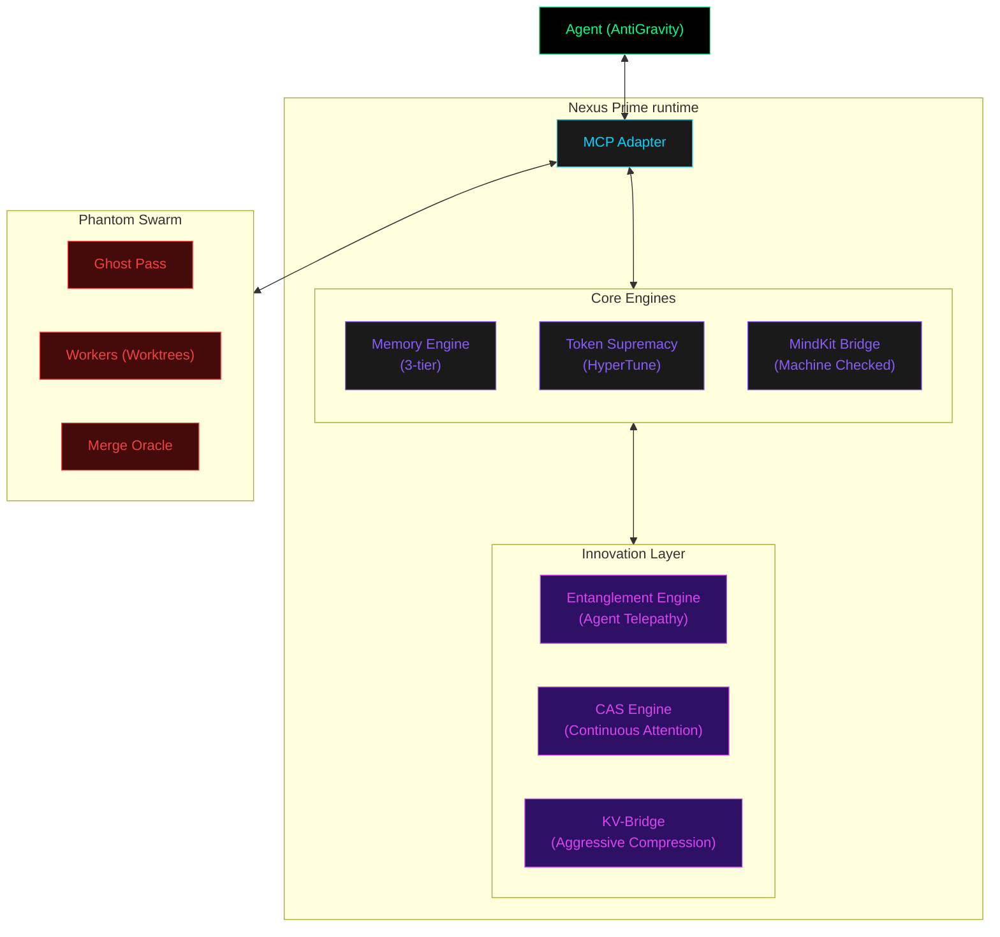

# 🧬 Nexus Prime

**The Meta-Framework for Autonomous AI Agents.**

Nexus Prime is an advanced MCP (Model Context Protocol) server that transforms standard AI agents into persistent, self-aware, and token-efficient entities. It provides a shared memory cortex, parallel "Phantom Worker" orchestration, and machine-checked guardrails that run as a background OS for your AI session.

[](LICENSE)
[](https://nodejs.org)
[](https://typescriptlang.org)
[](CHANGELOG.md)

---

## 🏗️ The Super Intellect Stack

Nexus Prime is the operational core of the **Sir-Ad AI Ecosystem**, bridges the gap between raw code and high-level reasoning.

```mermaid
graph BT
    L1["File / Raw Code"] --- L2["JSON Objects"]
    L2 --- L3["MCP Tools"]
    L3 --- L4["Grain Primitives"]
    L4 --- L5["Thought (Natural Language)"]
    
    subgraph Stack["Nexus Prime Layer"]
        L3
        L4
    end
    
    style Stack fill:#1e1e2e,stroke:#89b4fa,stroke-width:2px
```



| Project | Role | description |
| :--- | :--- | :--- |
| **Phantom** | PM | "What to build" — High-level orchestration & release management. |
| **MindKit** | Skills | "How to think" — Routing, skill-cards, and semantic guardrails. |
| **Nexus Prime**| OS | "How to run" — Memory, token optimization, parallel workers. |
| **Grain** | Language | "How to speak" — Universal AI primitives and CAS compression. |

---

## ✨ Key Capabilities

### 🧠 3-Tier Persistent Memory
Stop the "Cold Start" problem. Nexus Prime stores every insight, bug fix, and architectural decision across sessions.
- **Prefrontal Cortex**: Immediate working set (Active).
- **Hippocampus**: Recent session history (Cached).
- **Cortex**: Long-term SQLite-backed knowledge (Persistent).

### ⚡ Token Supremacy
Drastically reduce context window costs using **HyperTune™** logic.
- **50-90% Savings**: Agents read only the most relevant chunks of files.
- **Greedy Knapsack Optimization**: Maximize information gain within a fixed token budget.

### 🐝 Phantom Worker Swarms
Parallelize complex tasks using **Git Worktrees**.
- **Ghost Pass**: Read-only risk analysis and pre-flight planning.
- **Spawn Workers**: Dispatches parallel agents to explore different strategies simultaneously.
- **Merge Oracle**: Byzantine consensus to synthesize the most robust solution.

### 🛡️ MindKit Guardrails
Machine-checked safety before destructive operations.
- Scores actions 0-100 against safety protocols.
- Blocks destructive commands (e.g., `rm -rf`) and context window blowouts.

---

## 🛠️ MCP Toolset (20 Tools)

Nexus Prime exposes 20 powerful tools to your agent.

### 💾 Memory & Knowledge
- `nexus_store_memory`: Persist insights to long-term cortex.
- `nexus_recall_memory`: Vector-search prior session findings.
- `nexus_memory_stats`: Monitor cortex health and Zettelkasten links.
- `nexus_graph_query`: Traverse the knowledge graph via BFS/DFS.

### 🚀 Optimization & Performance
- `nexus_optimize_tokens`: Generate optimized file-reading plans.
- `nexus_hypertune_max`: Deep chunk-level relevance optimization.
- `nexus_cas_compress`: Compress token streams via Continuous Attention.
- `nexus_kv_bridge_status`: Monitor Adaptive KV Cache performance.

### 🤖 Autonomy & Orchestration
- `nexus_ghost_pass`: Pre-flight risk and approach analysis.
- `nexus_spawn_workers`: Dispatch parallel Phantom workers.
- `nexus_audit_evolution`: Identify recurring failure hotspots.
- `nexus_session_dna`: Snapshot state for perfect session handover.

### 🧬 Self-Improvement
- `nexus_darwin_propose`: Propose core engine improvements.
- `nexus_darwin_review`: Apply validated self-modifications.
- `nexus_skill_register`: Declaratively register new skill cards.

---

## 📐 System Architecture



---

## 📂 Project Structure

```bash
nexus-prime/
├── src/
│   ├── agents/          # Agent adapters (MCP, CLI)
│   ├── engines/         # 30+ Core logic engines (Memory, Tokens, CAS)
│   ├── phantom/         # Parallel worker orchestration
│   └── index.ts         # Main entry point
├── docs/                # Documentation & Architecture diagrams
├── scripts/             # Utility & setup scripts
└── .nexus-prime/        # Persistent local memory (SQLite)
```

---

## 🚀 Quick Start

### 1. Installation
```bash
npm install -g nexus-prime
```

### 2. Configure MCP (Optional)
Add this to your IDE/Agent configuration (e.g., Cursor, Claude Desktop):

```json
"nexus-prime": {
  "command": "node",
  "args": ["/path/to/nexus-prime/dist/cli.js", "mcp"]
}
```

### 3. Verification
Call `nexus_memory_stats` to ensure the memory cortex is online.

---

## 📜 License

MIT © [Sir-Ad](https://github.com/sir-ad)
