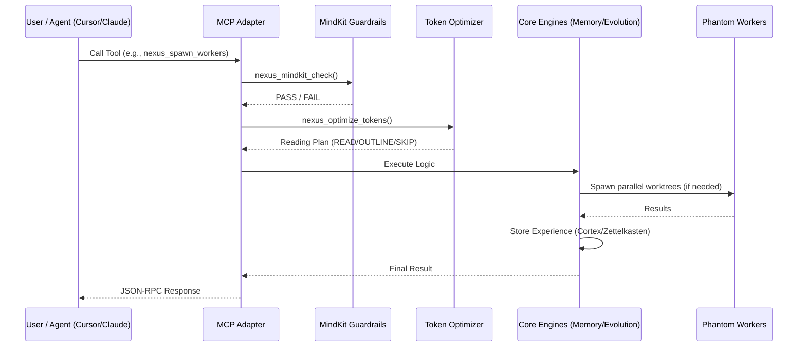
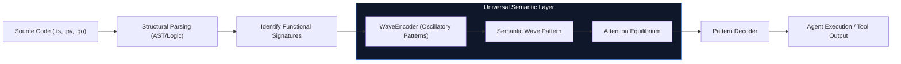

<div align="center">
  <h1>🧬 Nexus Prime</h1>
  <p><strong>The Cognitive Operating System for Multi-Agent Swarms</strong></p>

  [](https://github.com/sir-ad/nexus-prime/releases)
  [](LICENSE)
  [](https://www.typescriptlang.org/)
  [](https://nodejs.org)
</div>

---

**Nexus Prime** is a hyper-optimized, distributed, Byzantine-fault-tolerant cognitive operating system. Exposed as an MCP (Model Context Protocol) server or integrated programmatically, it provides single and multi-agent systems with **permanent memory, mathematically optimized context limits, safety guardrails, and massively parallel Git-worktree execution.**

### Supported MCP Clients

Nexus Prime provides first-class, automated integration with the following AI coding tools:

- 🔵 **Cursor** (IDE)
- 🍊 **Claude Code** (CLI)
- 🟢 **Opencode** (Editor)
- 🟣 **Kilocode** (Experimental)
- 🔴 **Codex** (Integration Hub)
- 🛡️ **Antigravity** (Autonomous Agent)

### Automated Integration (Recommended)

As of `v1.4.0`, you can automatically configure your favorite tools using the CLI:

```bash
# Setup Cursor integration
nexus-prime setup cursor

# Setup Claude Code integration
nexus-prime setup claude

# Setup Opencode integration
nexus-prime setup opencode

# Check all integration statuses
nexus-prime setup status
```

#### Manual Configuration
To manually add to Claude Desktop / AntiGravity, add this to your `mcpServers` config:

```json
{
  "nexus-prime": {
    "command": "npx",
    "args": ["-y", "nexus-prime", "mcp"]
  }
}
```

---

## ⚡ Why Nexus Prime?

| Capability | Standard Agent Loops | Nexus Prime |
|---|---|---|
| **Multiple AIs working together** | ❌ Prompt collision / Overwrites | ✅ Isolated Git Worktrees + POD Mesh |
| **Context Window Efficiency** | 🐢 Blindly loads whole files | **⚡ Knapsack Optimizer (saves 50-90%)** |
| **Session Memory** | ❌ Wiped after chat ends | ✅ 3-Tier SQLite Cortex (Zettelkasten) |
| **Conflict Resolution** | ❌ Manual git merge | **✅ Merge Oracle (Byzantine Consensus)** |
| **Command Execution Safety** | ❌ Blind execution | ✅ MindKit Guardrail Checkpoints |
| **Code Modularity** | 1 Monolithic Prompt | ✅ 20 granular Native MCP Tools |

---

## 🧠 Core Capabilities

### 1. 3-Tier Semantic Memory (Cortex)

Solves the "catastrophic forgetting" problem of isolated LLM sessions. Every insight is tagged, prioritized, and linked into a persistent SQLite Zettelkasten.

```typescript
import { MemoryEngine } from 'nexus-prime/engines';

const memory = new MemoryEngine({ dbPath: './.nexus-prime/memory.db' });

// Store an architectural decision with prioritization
await memory.store({
  content: 'Auth routing must bypass edge middleware for /api/health.',
  priority: 0.95, 
  tags: ['#architecture', '#auth', '#performance']
});

// Recall via semantic and BFS/DFS graph traversal
const context = await memory.recall('middleware constraints', { limit: 5 });
console.log('Context retrieved in:', context.latencyMs); // ~2ms
```

**Memory Methods:**

| Method | Description | Returns |
|---|---|---|
| `store(payload)` | Write to Hippocampus, flush to Cortex on consensus | `string (MemoryID)` |
| `recall(query, opts)` | Semantic retrieval across vectors and tags | `Array<MemoryNode>` |
| `stats()` | Returns tier counts and graph density | `MemoryStats` |
| `graph.traverse(id)` | BFS/DFS traversal of Zettelkasten | `GraphPath` |

### 2. Token Supremacy (HyperTune Optimizer)

Nexus Prime does not truncate strings. It formulates file-reading as a **Greedy Knapsack Problem**, solving for maximum information gain (`value`) against token cost (`weight`).

```typescript
import { TokenSupremacy } from 'nexus-prime/engines';

const optimizer = new TokenSupremacy({ budget: 80000 });

const plan = await optimizer.generatePlan({
  task: 'Implement OAuth callback handler',
  files: ['src/auth/oauth.ts', 'src/auth/utils.ts', 'package.json']
});

// Yields specific instructions for the agent to execute
// { "src/auth/oauth.ts": "READ_FULL", "src/auth/utils.ts": "OUTLINE", "package.json": "SKIP" }
```

**Performance Benchmarks:**

| Metric | Standard Context Load | Nexus HyperTune + CAS |
|---|---|---|
| **Token Consumption** | ~114,000 tokens | **~31,000 tokens (72% saved)** |
| **Knapsack Calculation Latency** | N/A | **< 15ms** |
| **Continuous Attention Stream (CAS)** | N/A | **Active (Learned Codebooks)** |
| **Semantic Fidelity** | 100% (Brute force) | **96% (Evaluated relevance)** |

---

## 🐝 Phantom Swarm & Agent Orchestration

Nexus Prime enables true parallelization by isolating agents into dynamically generated Git worktrees. Inter-worker communication happens over the local **POD Network**, and merges are mediated by the **Merge Oracle**.

```
┌─────────────────────────────────────────────────────────────────────┐
│ SWARM EXECUTION TOPOLOGY                                            │
├─────────────────────────────────────────────────────────────────────┤
│                                                                     │
│  [Main Branch] ──▶ GhostPass() (Risk Analysis)                      │
│                          │                                          │
│           ┌──────────────┼──────────────┐                           │
│           │              │              │                           │
│     [Worktree A]   [Worktree B]   [Worktree C]                      │
│     (UX Agent)     (API Agent)    (DB Agent)                        │
│           │              │              │                           │
│           └────┬─────────┴─────────┬────┘                           │
│                │                   │                                │
│                ▼                   ▼                                │
│        Entanglement Engine (Quantum-Inspired Hilbert Space)         │
│                │                                                    │
│                ▼                   ▼                                │
│      Merge Oracle (Byzantine Consensus + Hierarchical Synthesis)    │
│                │                                                    │
│                ▼                                                    │
│  [Main Branch] ◀── Commit & State Collapse                          │
└─────────────────────────────────────────────────────────────────────┘
```

### 3. Quantum-Inspired Agent Entanglement (Phase 9A)

Nexus Prime outdates explicit IPC messaging by utilizing a **Shared Quantum-State Vector**. Agents share mathematical state in a high-dimensional Hilbert space. When an agent "measures" (takes action), the shared state collapses via Born rule sampling, causing entangled agents to automatically make correlated decisions without explicit coordination.

```typescript
import { EntanglementEngine } from 'nexus-prime/engines';

const entanglement = new EntanglementEngine();

// Entangle 3 agents in a GHZ-like maximally entangled state
const state = entanglement.entangle(['ux-agent', 'api-agent', 'db-agent'], 4);

// UX Agent selects a strategy, collapsing the Hilbert space
const measurement = entanglement.measure(state.id, 'ux-agent');

console.log(`UX Agent collapsed state. Probability: ${measurement.probability}`);
console.log(`Correlations shifted for API & DB agents:`, measurement.correlations);
```

### 4. Merge Oracle & Byzantine Consensus

The Swarm does not rely on simple LLM voting. The `MergeOracle` evaluates all worker AST diffs and produces a merge decision using **Byzantine-inspired voting** and **Hierarchical Synthesis**.

*   **Diff Parsing:** Parses unified diffs into individual overlapping hunks.
*   **Pearson Correlation:** Calculates correlation matrix between agent strategies.
*   **Conflict Resolution:** Favors structurally consistent changes via AST-level synthesis if consensus drops below 60%.

### Execution Protocol (Agent Orchestrator)

When invoking `/nexus-spawn` or the `nexus_spawn_workers` tool, the system adheres to strict routing tables:

| Request Intent | Sub-Agents Spawned | Execution Order |
|---|---|---|
| "Full stack feature" | UX Designer + Backend Engineer | **Parallel**, cross-communicating via POD |
| "Database Migration" | DB Architect → Backend Engineer | **Sequential**, DB schema unblocks API |
| "Bug Hunt" | 3x Parallel QA Agents | **Parallel Competitive**, first to find wins |
| "Refactor Module" | Senior Coder → Security Auditor | **Sequential Pipeline** |

```typescript
import { PhantomSwarm } from 'nexus-prime/orchestrator';

const swarm = new PhantomSwarm();

// Dispatch parallel agents into isolated sandboxes
const results = await swarm.dispatch({
  goal: "Migrate user settings to Postgres",
  agents: ['db-migrator', 'api-refactor'],
  topology: 'parallel-mesh'
});

// Monitor the Merge Oracle negotiating conflicts
swarm.on('consensus.reach', (state) => {
  console.log(`Merged ${state.filesResolved} files with ${state.confidence}% certainty.`);
});
```

---

## 🛡️ MindKit Security & Guardrails

Machine-checked boundaries prevent dangerous modifications before they reach the shell.

| Threat Category | Mitigation | Execution Overhead |
|---|---|---|
| `rm -rf /` commands | Static AST analysis block | **~0.1ms** |
| Massive payload dumps | Size boundary interception | **~0.05ms** |
| Token window blowouts | Token budget pre-calculation | **~2ms** |
| Architectural divergence | **HITL (Human in the Loop) Checkpoint** | Pauses execution |

```bash
# Example MCP Tool invocation triggering a Guardrail Check
> Call: nexus_mindkit_check(action: "Delete legacy /common folder")

# Result:
[ 🛑 CTO CHECKPOINT ]
Severity: HIGH
Violation: Deletion of shared module limits bounded-context. 
Action: Require Human Affirmation.
```

---

## 🛠️ Architecture Deep Dive

### 1. Request Handling Lifecycle

Nexus Prime processes requests through a multi-layered cognitive stack, ensuring every action is optimized, checked for safety, and stored in long-term memory.



### 2. Language Specifications & Semantic Encoding

Nexus Prime is language-agnostic. It treats code as a structural expression of intent, encoding multi-modal inputs into a universal semantic wave pattern.



---

---

---
 
 ## 🌐 NexusNet Platform Integration
 
 Deploy swarms beyond localhost via NexusNet federation. Share atomic insights via the **GitHub Gist Relay**.
 
 | Feature | Description |
 |---|---|
 | Auto-Gist Sync | High-priority memories (Priority >= 0.8) automatically publish to a private GitHub Gist vault. |
 | Entanglement | Synchronize `<cortex>` databases across different machines using `nexus_net_sync`. |
 | Edge EventBus | Streams real-time `events.jsonl` to the local `/dashboard` via SSE in < 5ms. |
 | **Nexus Layer (NXL)** | Declarative YAML-based agent archetypes and swarm orchestration. |
 | **Gist Federation** | Integrated `nexus_publish_trace` tool for federated research chains. |
 
 ---
 
 ## 🚀 Nexus Swarm v1.5 "Intelligence Expansion"
 
 The Nexus Layer introduces **Mandatory Induction**. Any complex goal (>50 chars) automatically induces an army of specialized agents by default.
 
 ```yaml
 # Example .nxl configuration
 archetype: product-dev
 swarm:
   min_agents: 3
   fission: exponential
   memory_mode: thermodynamic
 ```

---

## 💻 CLI Commands & Syntax

Nexus Prime offers an extensive CLI for direct CI/CD and script integration.

```bash
# Swarm Operations
npx nexus-prime swarm spawn --goal "Fix login" --agents 3
npx nexus-prime swarm status

# Memory Operations
npx nexus-prime memory recall --query "last database schema update"
npx nexus-prime memory flush --dry-run
npx nexus-prime memory stats

# Diagnostics
npx nexus-prime audit --deep
npx nexus-prime benchmark
```

---

## ⚙️ Configuration (`nexus-prime.config.json`)

Configure at the root of your project:

```json
{
  "version": "1.0",
  "memory": {
    "provider": "sqlite",
    "path": "./.nexus-prime/memory.db",
    "autoFlushIntervalMs": 60000
  },
  "swarm": {
    "maxWorktrees": 5,
    "consensusProtocol": "pbft",
    "timeoutMs": 300000
  },
  "security": {
    "hitlRequired": ["delete", "publish"],
    "maxTokensPerOp": 80000
  }
}
```

---

## 🚀 Testing & Contribution

We utilize **London School TDD** with behavioral verification. 

```bash
# Run unit boundaries
npm run test:unit

# Test Swarm Byzantine Consensus simulation
npm run test:consensus

# Start the interactive UI testbed
npm run test:ux
```

**License:** MIT  
**Maintainers:** The Nexus Prime Protocol Consortium
