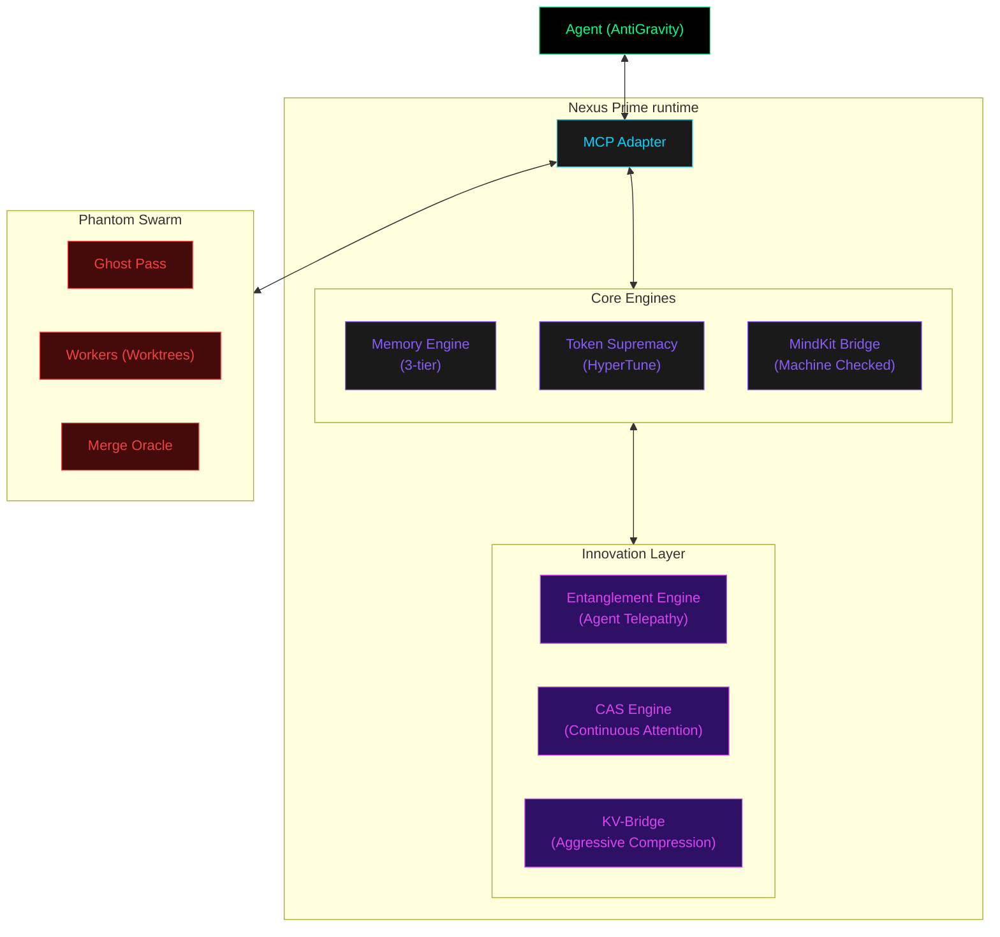
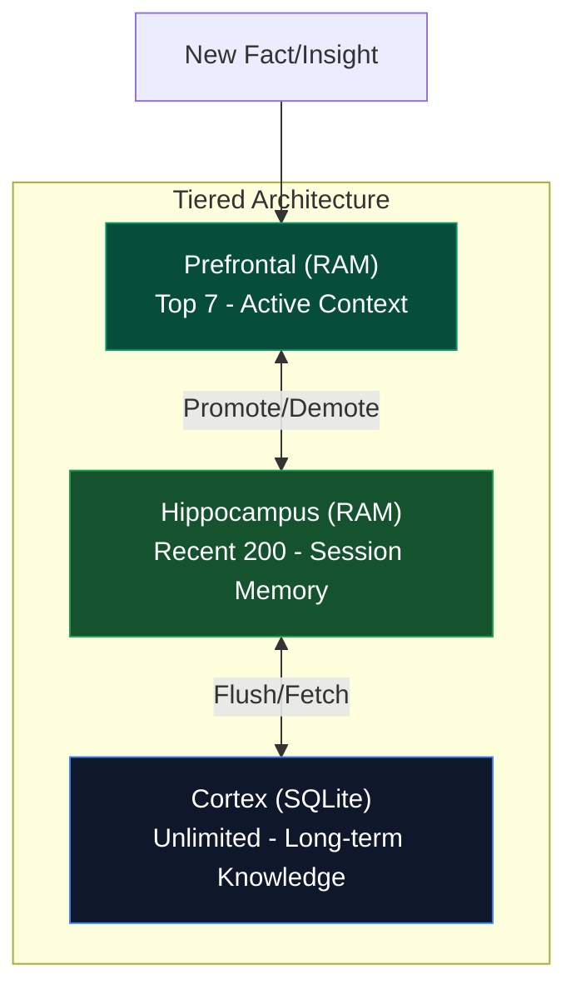
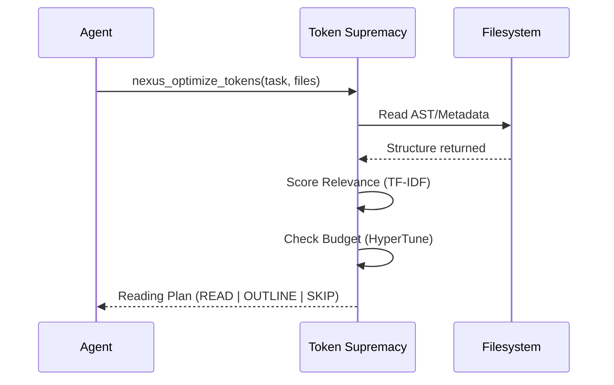
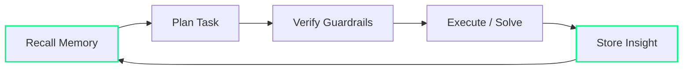
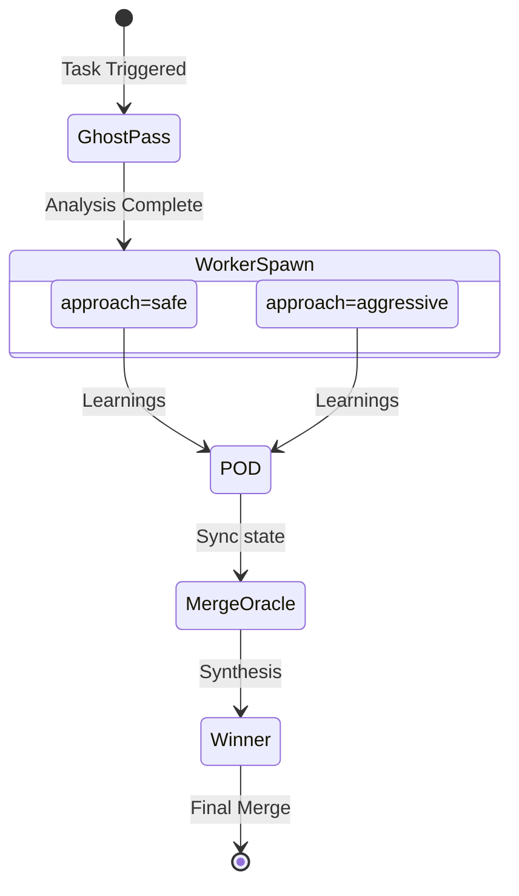
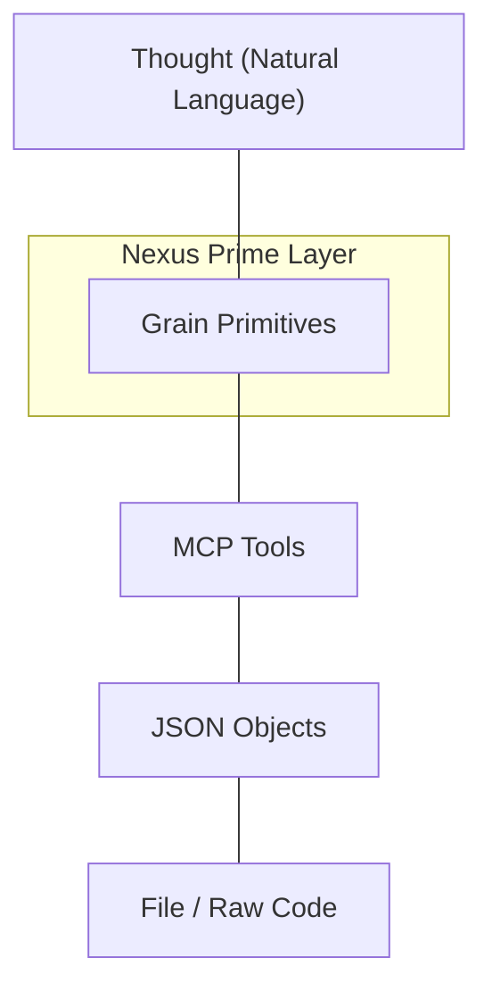

# Nexus Prime — Architecture Diagrams (Draft)

## 1. System Architecture (Phase 9 - Quantum/CAS Integrated)

## 2. Memory Tier Visualization

## 3. Token Optimization Flow

## 4. Agent Self-Awareness Loop

## 5. Phantom Worker Swarm

## 6. Super Intellect Stack (Language)

