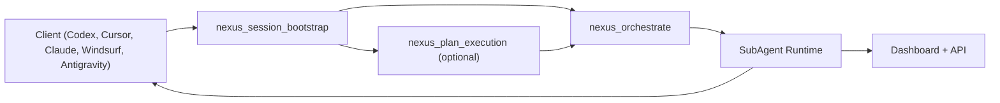
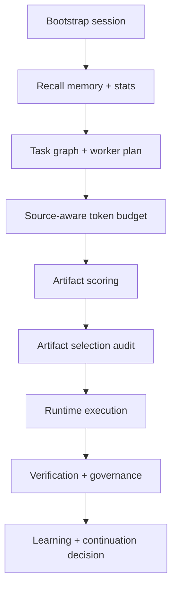
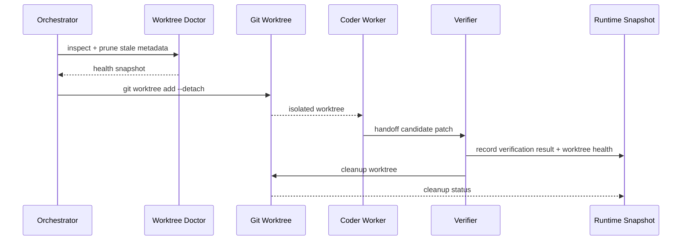
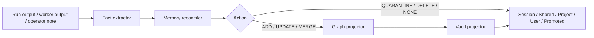
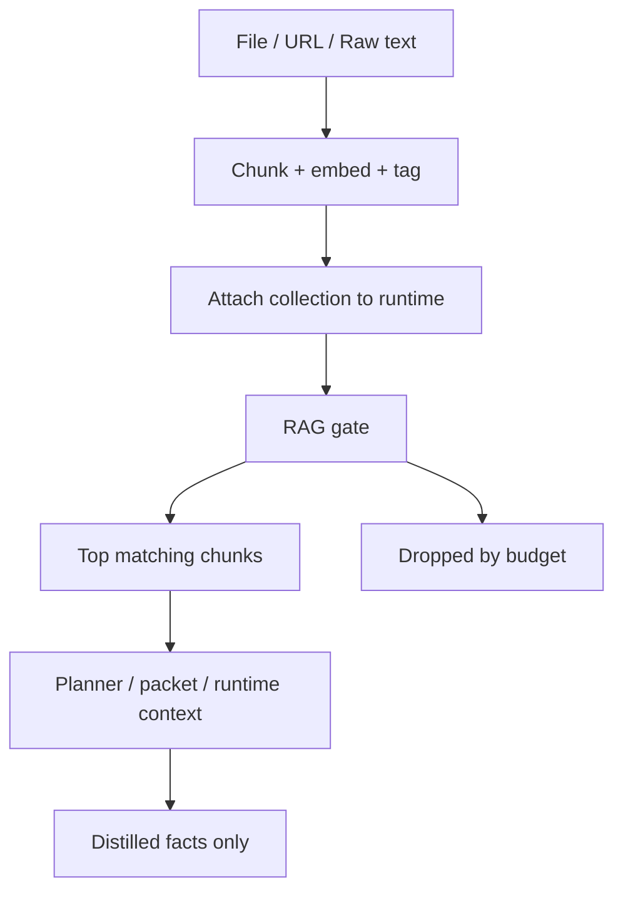
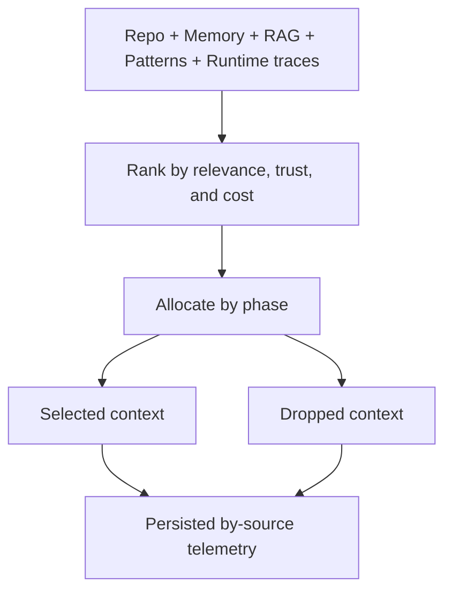
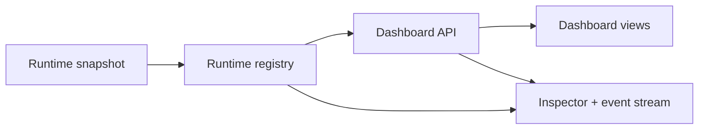
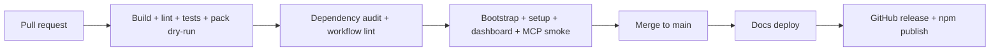

# Nexus Prime Architecture Diagrams

This document mirrors the shipped public architecture page and describes the system that is currently exposed in the product.

## 1. Control Plane and Entrypoints

## 2. Orchestration Contract

## 3. Worktree Execution Lifecycle

## 4. Memory Fabric and Reconciliation

## 5. RAG Ingestion and Retrieval Gate

## 6. Source-Aware Token Budget

## 7. Dashboard and Runtime Truth Data Flow

## 8. CI and Release Pipeline

