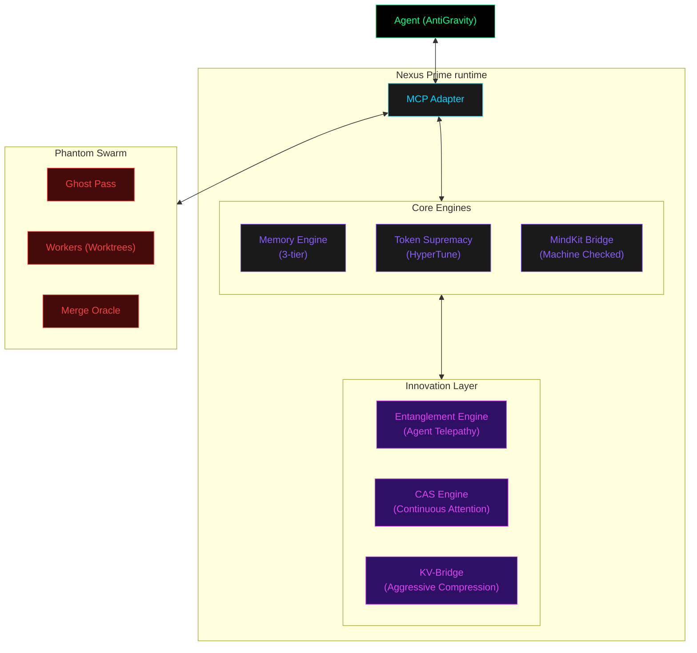
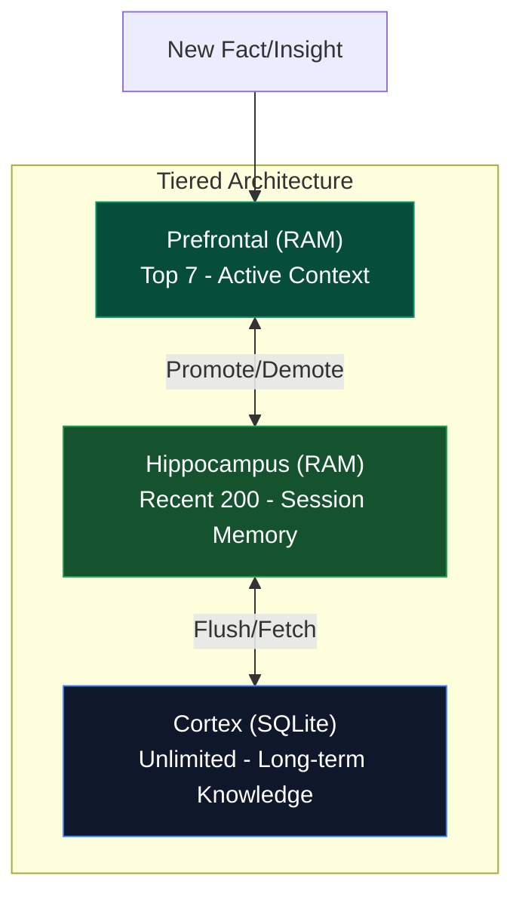
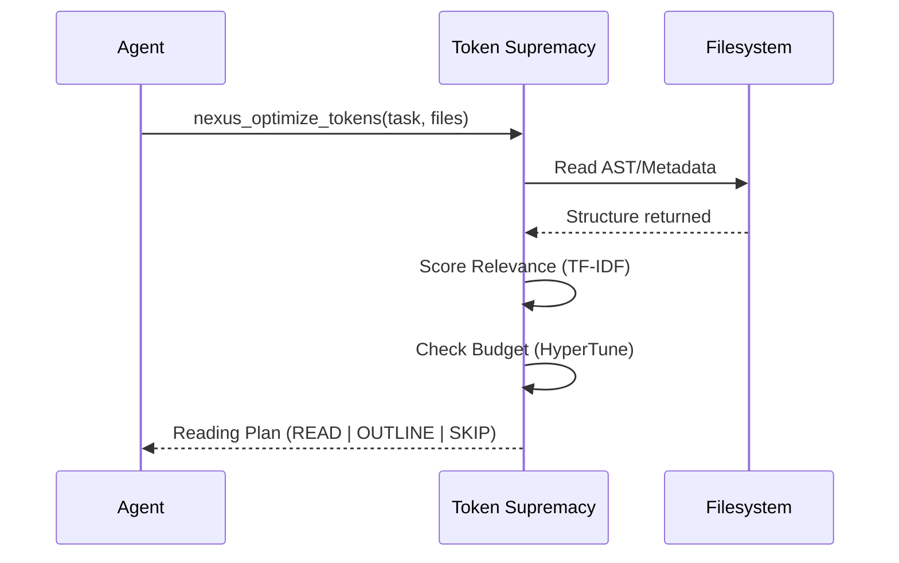
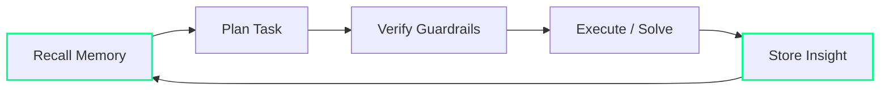
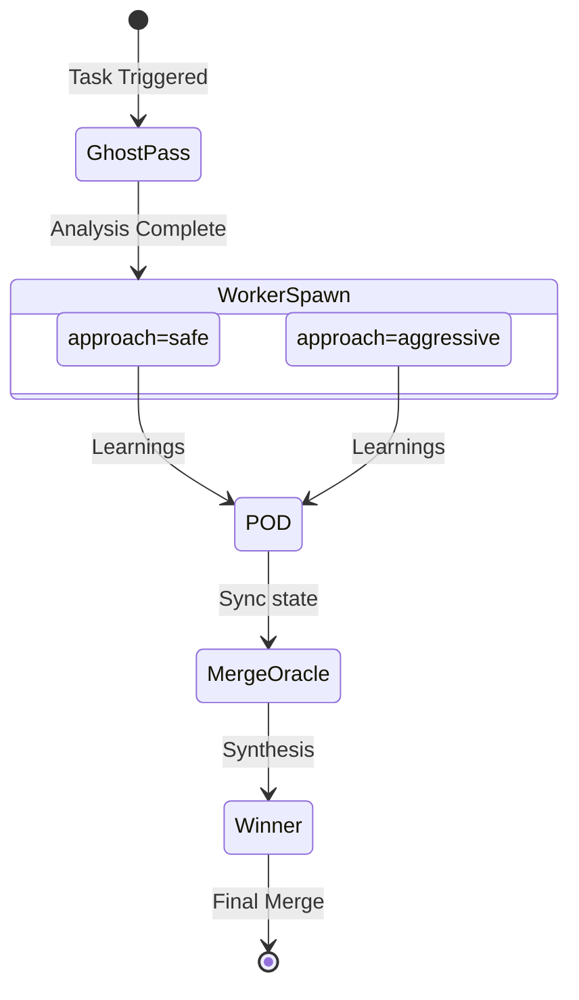
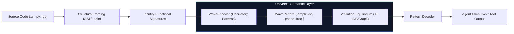

# Nexus Prime — Architecture Diagrams (Draft)

## 1. System Architecture (Phase 9 - Quantum/CAS Integrated)



## 2. Memory Tier Visualization



## 3. Token Optimization Flow



## 4. Agent Self-Awareness Loop



## 5. Phantom Worker Swarm



## 6. Super Intellect Stack (Language)

```mermaid
graph BT
    L1["File / Raw Code"] --- L2["JSON Objects"]
    L2 --- L3["MCP Tools"]
    L3 --- L4["Grain Primitives"]
    L4 --- L5["Thought (Natural Language)"]
    
    subgraph Stack["Nexus Prime Layer"]
        L4
    end

## 7. Request Handling Lifecycle (Detailed)

```mermaid
sequenceDiagram
    participant U as User / Agent (Cursor/Claude)
    participant M as MCP Adapter
    participant G as MindKit Guardrails
    participant T as Token Optimizer
    participant E as Core Engines (Memory/Evolution)
    participant W as Phantom Workers
    
    U->>M: Call Tool (e.g., nexus_spawn_workers)
    M->>G: nexus_mindkit_check(action, files)
    G->>G: Static AST Analysis
    G-->>M: PASS (Score: 0.95)
    M->>T: nexus_optimize_tokens(task, files)
    T->>T: Greedy Knapsack Optimization
    T-->>M: Reading Plan (READ/OUTLINE/SKIP)
    M->>E: Execute Logic
    E->>E: Memory Recall (Semantic/Vector)
    E->>W: Spawn parallel worktrees (Git Worktrees)
    W-->>E: POD Network Learning Broadcast
    E->>E: Merge Oracle (Synthesis)
    E->>E: Store Experience (Hippocampus -> Cortex)
    E-->>M: Final Result (Confidence: 0.9)
    M-->>U: JSON-RPC Response
```

## 8. Language Specifications & Semantic Encoding

Nexus Prime's internal representation uses oscillatory wave patterns to represent code logic across different languages.


```
